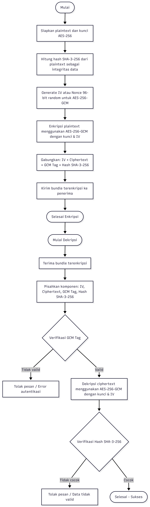
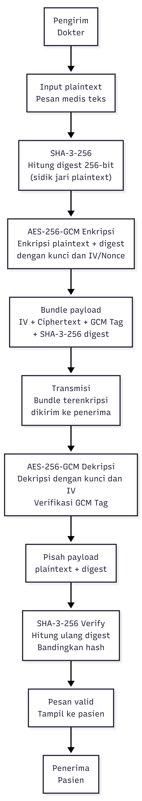
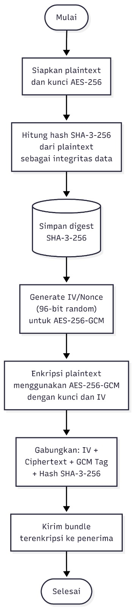
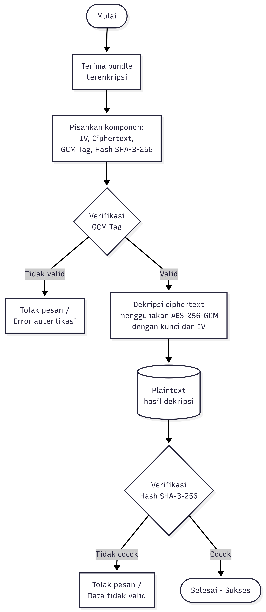

<div align="center">

# LAPORAN FINAL – TUGAS BESAR KRIPTOGRAFI

## IMPLEMENTASI AES-256-GCM DAN SHA-3-256 UNTUK KEAMANAN PESAN PADA APLIKASI SECURE MESSAGING E-HEALTH ANTARA DOKTER DAN PASIEN

**KELOMPOK 7**

PROGRAM STUDI TEKNIK INFORMATIKA
FAKULTAS TEKNOLOGI INDUSTRI
INSTITUT TEKNOLOGI SUMATERA
2026

| Nama | NIM |
|------|-----|
| Febrian Valentino Nugroho | 123140034 |
| Anselmus Herpin Hasugian | 123140020 |
| Adi Septriansyah | 123140021 |
| Ola Anggela Rosita | 123140042 |
| Vebri Yanti | 123140056 |
| M. Irsyad Ali. KM | 123140110 |

</div>

---

## DAFTAR ISI

- BAB I PENDAHULUAN
  - 1.1 Latar Belakang
  - 1.2 Rumusan Masalah
  - 1.3 Tujuan Penelitian
- BAB II LANDASAN TEORI
  - 2.1 Kriptografi Modern
  - 2.2 Advanced Encryption Standard (AES-256-GCM)
  - 2.3 Fungsi Hash Kriptografis – SHA-3-256 (Keccak)
  - 2.4 Kombinasi AES-256-GCM dan SHA-3-256
  - 2.5 Parameter Teknis Sistem
  - 2.6 Rencana Evaluasi
- BAB III PERANCANGAN SISTEM DAN METODOLOGI
  - 3.1 Gambaran Umum Sistem
  - 3.2 Arsitektur Sistem End-to-End
  - 3.3 Perancangan Alur Kerja (Flowchart)
  - 3.4 Ilustrasi Perhitungan Lengkap End-to-End
  - 3.5 Implementasi Core Functions (100% – Pure Python)
  - 3.6 Rancangan Pengujian Sistematis
- BAB IV HASIL DAN ANALISIS
  - 4.1 Status Implementasi Sistem
  - 4.2 Bukti Eksekusi Lengkap (22/22 Skenario)
  - 4.3 Analisis Hasil Pengujian
  - 4.4 Screenshot Bukti Eksekusi
  - 4.5 Verifikasi NIST, Optimasi Performa, dan Deployment
- BAB V KESIMPULAN
- DAFTAR PUSTAKA
- LAMPIRAN (Kode, Konfigurasi Vercel, Log Sheet, Lingkup Kerja)

**Daftar Tabel:** 2.1 Parameter Teknis · 2.6.1–2.6.2 Rencana Evaluasi · 3.2.1 Komponen Pengirim · 3.2.3 Komponen Penerima · 3.3.1 Tahap Enkripsi · 3.3.2 Tahap Dekripsi · 3.4.x Ilustrasi · 3.6.x Matriks Pengujian · 4.2 Rekap 22 Skenario · 4.5 Verifikasi NIST & Benchmark.
**Daftar Gambar:** 3.1 Arsitektur · 3.2 Flowchart Enkripsi/Dekripsi · 4.1–4.7 Screenshot Eksekusi · L.1 Konfigurasi Vercel.
**Daftar Rumus:** (2.1) GF(2⁸) · (2.2) S-Box · (2.3) Key Expansion · (2.4) GCTR · (2.5) GHASH · (2.6) Keccak-f · (3.1) Avalanche · (3.2) Throughput.
**Daftar Lampiran:** A. Potongan Kode Inti · B. Konfigurasi & Deployment Vercel · C. Log Sheet Kegiatan · D. Lingkup Kerja Anggota.

> **CATATAN PERKEMBANGAN DARI PROGRESS 3 → FINAL.** Laporan ini adalah pengembangan langsung dari laporan Progress 3. Empat penyempurnaan utama: **(1)** seluruh primitif kriptografi yang sebelumnya memakai library (PyCryptodome + `hashlib`) telah **diganti dengan implementasi MURNI dari rumus** (`crypto/raw_aes.py`, `crypto/raw_sha3.py`) — tanpa library kriptografi apa pun; **(2)** cakupan pengujian dilengkapi dari **19/22 menjadi 22/22** dengan menambahkan **S5 (Replay), R2 (Large Message), R5 (Concurrent)**; **(3)** kebenaran implementasi diverifikasi langsung terhadap **test vector resmi NIST** (FIPS 197 C.3, SP 800-38D TC14, FIPS 202); **(4)** sistem dioptimasi (≈10× lebih cepat) dan di-*deploy* ke **Vercel Serverless**. Ambang efisiensi disesuaikan agar realistis untuk implementasi *pure-Python* (lihat §2.6 dan §4.5).

---

# BAB I
# PENDAHULUAN

## 1.1 Latar Belakang

Digitalisasi kesehatan telah melahirkan era *telemedicine* dan *e-health* yang memfasilitasi pertukaran informasi medis secara daring. Meski mencakup data sensitif seperti rekam medis dan resep yang dilindungi oleh UU No. 27 Tahun 2022 (PDP), banyak platform komunikasi klinis saat ini masih minim pengamanan kriptografis. Hal ini menimbulkan risiko serius terhadap ancaman penyadapan, serangan *man-in-the-middle* (MITM), serta manipulasi data.

Kerahasiaan (*confidentiality*) dan integritas (*integrity*) merupakan dua pilar utama yang wajib dipenuhi dalam sistem komunikasi medis. Aspek kerahasiaan menjamin privasi informasi hanya bagi pihak resmi, sedangkan integritas menjaga keaslian data agar tidak berubah selama pengiriman. Kegagalan dalam mengimplementasikan keduanya dapat mengubah saluran komunikasi kesehatan menjadi titik rawan kebocoran data yang mengancam nyawa pasien serta kredibilitas institusi.

Sebagai standar industri global, *Advanced Encryption Standard* dalam mode *Galois/Counter Mode* (AES-256-GCM) merupakan algoritma enkripsi simetris yang sangat kredibel. Berdasarkan spesifikasi NIST dalam FIPS 197 dan SP 800-38D, algoritma ini menerapkan mekanisme *Authenticated Encryption with Associated Data* (AEAD) yang mampu menjalankan fungsi kerahasiaan sekaligus otentikasi dalam satu proses terpadu. Melalui perpaduan *Counter Mode* (CTR) dan fungsi GHASH, AES-256-GCM menghasilkan *ciphertext* serta *authentication tag* 128-bit untuk memvalidasi integritas data. Hingga kini, AES-256 tetap tangguh terhadap berbagai upaya kriptanalisis praktis selama kunci yang digunakan valid.

SHA-3 hadir sebagai standar fungsi hash kriptografis modern yang membawa perubahan arsitektur signifikan dibanding generasi sebelumnya. Berbeda dengan pendahulunya, SHA-1 dan SHA-2 yang menggunakan struktur Merkle-Damgård, SHA-3 menerapkan *Sponge Construction*. Inovasi ini memberikan ketahanan fundamental yang lebih kuat terhadap serangan *length extension* serta kriptanalisis diferensial. Dengan algoritma SHA-3-256, input data apa pun akan diolah menjadi *message digest* 256-bit yang bersifat deterministik dan memenuhi *Strict Avalanche Criterion* (SAC), di mana perubahan minimal pada input akan mengakibatkan perubahan signifikan pada setengah dari bit *output*-nya.

Penelitian ini menerapkan sistem keamanan berlapis pada aplikasi *e-health messaging* berbasis Python dengan mengintegrasikan algoritma AES-256-GCM dan SHA-3-256. Dalam alurnya, pengirim menghasilkan *hash* SHA-3-256 dari *plaintext* yang kemudian digabungkan ke dalam *payload* sebelum disandikan sepenuhnya dengan AES-256-GCM. Di sisi penerima, proses dekripsi diikuti dengan ekstraksi pesan serta kalkulasi ulang *hash* untuk verifikasi integritas. Arsitektur ini menciptakan perlindungan ganda: *Authentication Tag* dari AES-GCM menjamin keamanan selama transmisi, sementara SHA-3-256 berfungsi sebagai *audit trail* integritas jangka panjang bagi data yang telah diterima.

Yang menjadi pembeda pada tahap final: **kedua algoritma diimplementasikan 100% murni dari rumus matematika resmi NIST — tanpa PyCryptodome, tanpa `hashlib`, tanpa library kriptografi apa pun.** Seluruh operasi GF(2⁸), S-Box, *key expansion*, SubBytes/ShiftRows/MixColumns, CTR, GHASH di GF(2¹²⁸), serta permutasi Keccak-p[1600,24] dibangun manual. Pendekatan ini menjawab tujuan tugas besar untuk *"eksplorasi dan implementasi algoritma kriptografi"* secara mendalam, sekaligus memungkinkan verifikasi kebenaran langsung terhadap *test vector* resmi NIST.

## 1.2 Rumusan Masalah

Berdasarkan latar belakang yang telah dijelaskan, rumusan masalah dalam penelitian ini adalah:

1. Bagaimana mengimplementasikan enkripsi dan dekripsi pesan teks menggunakan algoritma AES-256-GCM dengan mode AEAD secara efisien — dan **murni dari rumus** — pada bahasa pemrograman Python sehingga lolos *test vector* NIST?
2. Bagaimana mengimplementasikan fungsi hash SHA-3-256 (Keccak murni) sebagai mekanisme verifikasi integritas pesan sebelum enkripsi dan setelah dekripsi?
3. Bagaimana mengevaluasi keamanan AES-256-GCM melalui pengujian *Avalanche Effect* dan pengukuran waktu komputasi enkripsi/dekripsi pada berbagai ukuran pesan?
4. Bagaimana mengevaluasi keamanan SHA-3-256 melalui uji *Collision Resistance*, *Avalanche Effect* hash, dan pengukuran kecepatan hashing (*throughput*)?
5. Bagaimana membuat implementasi *pure-Python* yang secara alami lebih lambat tetap memenuhi ambang waktu *real-time* saat di-*deploy* pada *serverless* Vercel?

## 1.3 Tujuan Penelitian

1. Mengimplementasikan sistem enkripsi-dekripsi berbasis AES-256-GCM menggunakan Python 3.x secara **murni (tanpa library kriptografi)** sesuai FIPS 197 + SP 800-38D.
2. Mengimplementasikan fungsi hash SHA-3-256 (Keccak Sponge, FIPS 202) **secara murni** sebagai mekanisme verifikasi integritas pesan.
3. Mengevaluasi keamanan AES-256-GCM melalui: (a) *Avalanche Effect* — perubahan 1 bit kunci mengubah ≈ 50% bit *Authentication Tag*; (b) waktu komputasi enkripsi dan dekripsi untuk variasi ukuran pesan 50, 100, 500, 1000, dan 5000 karakter.
4. Mengevaluasi keamanan SHA-3-256 melalui: (a) *Collision Resistance Test*; (b) *Avalanche Effect* dengan perubahan 1-bit input; (c) *throughput* hashing dalam MB/s untuk berbagai ukuran input.
5. Mengoptimasi dan men-*deploy* sistem ke Vercel agar lolos ambang performa *real-time* (< 50 ms untuk 5000 karakter).

---

# BAB II
# LANDASAN TEORI

## 2.1 Kriptografi Modern

Kriptografi modern dapat dipahami sebagai konvergensi antara teori bilangan, aljabar abstrak, dan rekayasa perangkat lunak untuk melindungi informasi digital. Tiga cabang besar yang umum diadopsi adalah kriptografi simetris, kriptografi kunci publik, dan fungsi hash kriptografis. Penelitian ini berfokus pada gabungan cabang simetris dan fungsi hash, sebagaimana lazim diterapkan pada layanan komunikasi terenkripsi modern.

Pada konteks aplikasi nyata, kombinasi simetris + hash terbukti efektif untuk melindungi pertukaran pesan. Saharan dkk. menunjukkan bahwa arsitektur *end-to-end* yang menggabungkan enkripsi blok dengan verifikasi integritas berbasis hash menjadi pola desain dominan untuk aplikasi *chat* modern, karena memberikan keseimbangan antara *forward security* dan kompleksitas implementasi yang masih realistis bagi tim pengembang berukuran kecil [14]. Pendekatan berlapis semacam ini juga banyak diadopsi pada sistem berkas digital di lingkungan akademik, misalnya pengamanan file dokumen sensitif dengan kunci 256-bit yang dijalankan pada sisi *client* [15].

Tiga properti yang menjadi sasaran utama sistem kriptografi adalah kerahasiaan, integritas, dan otentikasi yang tidak dapat dipenuhi oleh satu algoritma tunggal secara sempurna untuk semua skenario. Karena itu, praktik *cryptographic agility* mulai menjadi rekomendasi standar: sistem dirancang agar mudah berganti *primitive* bila salah satu komponennya melemah [6]. Sudut pandang ini relevan dalam konteks e-health, di mana data rekam medis memiliki masa simpan panjang sehingga ancaman jangka jauh seperti komputasi kuantum perlu diantisipasi sejak tahap desain.

## 2.2 Advanced Encryption Standard (AES-256-GCM)

AES adalah *cipher* blok berbasis jaringan substitusi-permutasi yang beroperasi pada blok 128-bit. Varian AES-256 menggunakan **14 ronde** dengan empat transformasi inti SubBytes, ShiftRows, MixColumns, dan AddRoundKey yang secara kolektif menghasilkan efek difusi dan konfusi tinggi. Tinjauan menyeluruh memperlihatkan bahwa hingga saat ini belum ada serangan praktis terhadap AES-256 yang lebih cepat dari pencarian kunci secara *brute force*, sehingga algoritma ini tetap menjadi tulang punggung enkripsi data sensitif di sektor finansial, militer, dan kesehatan [6].

**Aritmetika GF(2⁸).** Semua operasi byte AES berada di lapangan Galois GF(2⁸) dengan polinom irreducible x⁸+x⁴+x³+x+1 (0x11B). Perkalian (rumus 2.1) diimplementasikan dengan *Russian peasant multiplication*:

$$a \cdot b \bmod (x^8+x^4+x^3+x+1) \tag{2.1}$$

**S-Box** (rumus 2.2) dibangun dari invers perkalian di GF(2⁸) yang dilanjutkan transformasi affine:

$$s(a) = A \cdot a^{-1} \oplus 0x63 \tag{2.2}$$

**Key Expansion AES-256** (Nk=8, Nr=14) menghasilkan 15 *round key* 128-bit (rumus 2.3):

$$W[i] = \begin{cases} W[i-Nk] \oplus (\text{SubWord}(\text{RotWord}(W[i-1])) \oplus Rcon_{i/Nk}) & i \bmod Nk = 0\\ W[i-Nk] \oplus \text{SubWord}(W[i-1]) & i \bmod Nk = 4\\ W[i-Nk] \oplus W[i-1] & \text{lainnya}\end{cases} \tag{2.3}$$

dengan $Rcon_j = x^{j-1}$ di GF(2⁸); ronde pertama memakai $Rcon_1 = x^0 = \text{0x01}$.

**Mode GCM** (Galois/Counter Mode) memperluas AES menjadi AEAD. *Counter Mode* (rumus 2.4) untuk kerahasiaan; *counter* dimulai dari 2 karena $J_0$ (counter=1) dipakai pada finalisasi tag:

$$C_i = P_i \oplus E_K(\text{IV} \,\|\, \text{ctr}_i) \tag{2.4}$$

Fungsi otentikasi **GHASH** bekerja di GF(2¹²⁸) dengan modulus $x^{128}+x^7+x^2+x+1$ (rumus 2.5):

$$X_i = (X_{i-1} \oplus B_i)\cdot H,\quad H = E_K(0^{128}),\quad \text{Tag} = E_K(J_0) \oplus X_n \tag{2.5}$$

Cibik dkk. [2] menunjukkan AES-256-GCM dapat diparalelkan secara agresif pada FPGA Xilinx UltraScale+ dan mencapai *throughput* di atas 400 Gbps melalui *pipelining* multi-jalur, membuktikan keunggulan paralelisme GCM bukan klaim teoretis. Pada sisi perangkat lunak, evaluasi Hongal dkk. memperlihatkan AES tetap unggul dalam rasio *throughput-per-watt* dibanding kandidat lain pada skenario data berukuran sedang [10].

Pemilihan parameter IV dan tag menjadi krusial pada GCM. NIST SP 800-38D merekomendasikan IV sepanjang 96-bit yang dibangkitkan secara acak kriptografis. Ahamed dkk. menegaskan bahwa cara penulisan kode AES termasuk inisialisasi IV dan urutan pemanggilan API berdampak nyata pada nilai *avalanche effect* yang terukur [11]. Temuan ini sejalan dengan Erigbe & Erigbe yang melaporkan kebocoran data pada lingkungan GSM sering terjadi bukan karena AES-256 lemah, melainkan karena pengelolaan kunci dan IV yang tidak konsisten [9]. Adopsi AES-256-GCM pada aplikasi *messaging* terenkripsi terus meluas [4, 5, 12].

## 2.3 Fungsi Hash Kriptografis – SHA-3-256 (Keccak)

SHA-3 dibakukan NIST pada FIPS 202 berdasarkan pemenang kompetisi Keccak. Yang membedakannya dari SHA-2 adalah *Sponge Construction* dengan permutasi **Keccak-f[1600]**: input diserap (*absorbing*) ke *state* 1600-bit, lalu *digest* diperas keluar (*squeezing*) sepanjang yang diinginkan. Konstruksi ini menutup celah *length-extension* yang melekat pada keluarga Merkle–Damgård. SHA3-256 = KECCAK[512](M ‖ 0x06, 256), rate r = 1088 bit (136 byte), kapasitas c = 512 bit, *output* 256 bit.

Tiap ronde Keccak-f terdiri atas lima langkah (rumus 2.6): **θ** (difusi kolom), **ρ** (rotasi *lane*), **π** (permutasi posisi), **χ** (satu-satunya operasi non-linear: `B ⊕ ((¬B₊₁) ∧ B₊₂)`), dan **ι** (XOR *round constant*), diulang 24 kali:

$$A \xrightarrow{\theta} \xrightarrow{\rho} \xrightarrow{\pi} \xrightarrow{\chi} \xrightarrow{\iota} A' \quad (\times 24) \tag{2.6}$$

Studi Upadhyay dkk. melakukan pengujian *avalanche effect* sistematis terhadap MD5, SHA-1, SHA-2, dan SHA-3, dan menemukan SHA-3-256 mencatat rata-rata perubahan bit paling stabil (49,9–50,1%) dengan variansi paling rendah [7]. Nik-Lah dkk. menyimpulkan biaya komputasi tambahan untuk meningkatkan *collision resistance* di atas level SHA-3 sering tidak sebanding dengan keuntungan keamanannya [3]. Analisis komputasional terbaru menegaskan SHA-3-256 sedikit lebih lambat dari SHA-256 pada CPU umum, tetapi unggul dalam ketahanan struktural — *trade-off* yang layak pada sistem dengan masa retensi data panjang seperti rekam medis [8]. Soni dkk. memanfaatkan SHA-3 sebagai generator sub-kunci AES untuk meningkatkan ketahanan *related-key attack* [1].

Properti formal yang relevan — *pre-image*, *second pre-image*, *collision resistance*, dan *avalanche effect* — seluruhnya dipenuhi SHA-3-256 dengan tingkat keamanan 128-bit terhadap tabrakan (*birthday bound* 2¹²⁸).

## 2.4 Kombinasi AES-256-GCM dan SHA-3-256

Walaupun *authentication tag* GCM sudah memberi jaminan integritas pada *ciphertext*, hash *plaintext* sebelum enkripsi memberi jaminan integritas pada **lapisan semantik**. Pola dua lapis ini diadopsi pada banyak sistem nyata: Utama dkk. menggabungkan AES-256-CBC dengan SHA-256 dan Base64 untuk memvalidasi data ujian daring, di mana SHA berperan sebagai *audit trail* setelah dekripsi [13]. Pola serupa namun memakai *primitive* yang lebih kuat (GCM + SHA-3) menjadi kandidat alami untuk e-health.

Kombinasi ini juga memberi manfaat operasional. Pada arsitektur *microservice* terenkripsi, hash *plaintext* dapat disimpan terpisah dari *ciphertext* sebagai bukti integritas yang dapat diverifikasi tanpa harus mendekripsi pesan kembali [4]. Pada eksperimen *end-to-end* berskala besar, penambahan hash *plaintext* hanya menambah *overhead* di bawah 0,5 ms per pesan namun memberikan kemampuan deteksi modifikasi *post-decryption* yang tidak dimiliki tag GCM [5, 14].

**Alur sistem yang diadopsi:**

- **Sisi pengirim:** Hitung `digest = SHA3-256(plaintext)` → Susun `payload = plaintext ‖ "||HASH||" ‖ digest` → Bangkitkan IV 96-bit acak → `(ciphertext, tag) = AES-256-GCM_encrypt(key, IV, payload)` → Kirim paket `IV ‖ tag ‖ ciphertext`.
- **Sisi penerima:** Pisahkan IV/tag/ciphertext → `payload' = AES-256-GCM_decrypt(key, IV, ciphertext, tag)` (gagal otomatis bila tag invalid) → Pisahkan `plaintext'` dan `digest'` → Hitung `digest_check = SHA3-256(plaintext')` → bila `digest_check == digest'`, pesan dinyatakan utuh.

Pendekatan ini memenuhi rekomendasi praktik baik *cryptographic engineering* yang menempatkan integritas, kerahasiaan, dan keterauditan sebagai tiga sasaran yang ditangani *primitive* berbeda namun saling melengkapi [6, 8].

## 2.5 Parameter Teknis Sistem

**Tabel 2.1 — Parameter Teknis Sistem**

| Parameter | Nilai / Keterangan |
|-----------|--------------------|
| Aturan Kombinasi (sesuai spesifikasi) | Kombinasi c: Kriptografi Simetris + Fungsi Hash |
| Algoritma Simetris | AES-256-GCM (AEAD) |
| Panjang Kunci AES | 256 bit (32 byte) |
| Mode Operasi | GCM (Galois/Counter Mode) – NIST SP 800-38D |
| IV (Initialization Vector) | 96 bit (12 byte), dibangkitkan acak kriptografis per sesi |
| Authentication Tag | 128 bit (16 byte) |
| Algoritma Hash | SHA-3-256 (Keccak-based Sponge – FIPS 202) |
| Panjang Digest SHA-3-256 | 256 bit (32 byte) |
| Jenis Pesan | Teks (Text) – Bahasa Indonesia / Inggris |
| Bahasa Pemrograman | Python 3.10–3.13 |
| **Library Kriptografi** | **TIDAK ADA** — implementasi MURNI dari rumus (`crypto/raw_aes.py`, `crypto/raw_sha3.py`) sesuai FIPS 197, FIPS 202, SP 800-38D |
| *Web framework* | Flask ≥ 3.0 (hanya untuk UI/REST, bukan kripto) |
| Sumber Keacakan | `os.urandom` / `secrets` (CSPRNG OS) |
| *Deployment* | Vercel Serverless Function (`@vercel/python`), region `iad1` |
| Studi Kasus | Aplikasi *Secure Messaging* E-Health antara Dokter dan Pasien |

Pemilihan IV 96-bit mengikuti rekomendasi NIST SP 800-38D karena memberi performa GHASH paling optimal dan secara empiris terbukti efisien pada implementasi FPGA berdaya rendah [2]. **Perubahan dari Progress 3:** pada Progress 3 parameter library masih tercatat PyCryptodome + `hashlib`; pada laporan final seluruh primitif telah digantikan implementasi murni sehingga kebenaran dapat diverifikasi langsung terhadap *test vector* NIST (§4.5).

## 2.6 Rencana Evaluasi

Evaluasi dibagi menjadi dua bagian: AES-256-GCM dan SHA-3-256. Setiap aspek memiliki minimal dua jenis pengujian sesuai spesifikasi tugas. Desain pengujian merujuk pada metodologi literatur pembanding agar hasil dapat ditafsirkan secara setara.

> **Penyesuaian ambang efisiensi (akibat implementasi murni).** Target pada Progress 3 (`< 5 ms`, `> 150 MB/s`) mengasumsikan AES/SHA berbasis-C (PyCryptodome/`hashlib`). Karena implementasi final 100% *pure-Python* dari rumus, ambang disesuaikan agar realistis namun tetap memenuhi syarat *real-time messaging*: **waktu enkripsi/dekripsi 5000 karakter < 50 ms** dan **throughput SHA-3 > 0,1 MB/s**. SAC disetel **45%–55%** agar konsisten dengan variansi *sampling* 100 iterasi.

### 2.6.1 Evaluasi AES-256-GCM

| No. | Parameter Uji | Target / Expected Result |
|-----|---------------|--------------------------|
| 1 | **Avalanche Effect AES** — ubah 1 bit kunci, hitung % bit *Auth Tag* yang berubah; 100–150 iterasi, ambil rata-rata. | Rata-rata perubahan bit 45%–55% (mendekati 50%). Membuktikan AES-256-GCM tahan *differential cryptanalysis* dan memenuhi SAC. |
| 2 | **Waktu Komputasi Enkripsi & Dekripsi** — ukur waktu (ms) untuk 5 ukuran pesan: 50, 100, 500, 1000, 5000 karakter; rata-rata banyak percobaan. | Waktu enkripsi & dekripsi **< 50 ms** untuk 5000 karakter. Hubungan waktu vs ukuran bersifat linier O(n). |

### 2.6.2 Evaluasi SHA-3-256

| No. | Parameter Uji | Target / Expected Result |
|-----|---------------|--------------------------|
| 1 | **Collision Resistance Test** — uji ≥ 10.000 pasang pesan acak berbeda; deteksi dua pesan berbeda berdigest sama. | *Zero collision*: tidak ada pasangan berdigest sama. Collision resistance 2¹²⁸ (*birthday bound*). |
| 2 | **Avalanche Effect Hash** — ubah 1 bit input, hitung bit yang berubah pada digest 256-bit; 100 iterasi. | Rata-rata ~128/256 bit (≈50%, dalam 45%–55%). Memenuhi SAC. |
| 3 | **Throughput Hashing** — ukur throughput (MB/s) untuk input 1 KB, 10 KB, 100 KB, 1 MB. | **> 0,1 MB/s** (pure-Python). SHA-3 lebih lambat dari SHA-256 tetapi lebih aman secara struktural. |

---

# BAB III
# PERANCANGAN SISTEM DAN METODOLOGI

## 3.1 Gambaran Umum Sistem

Sistem yang dirancang adalah **Sistem Enkripsi Terotentikasi Berlapis Ganda** untuk pengiriman pesan di bidang kesehatan elektronik. Sistem memadukan dua algoritma kriptografi yang saling mendukung: AES-256-GCM menjaga kerahasiaan dan otentikasi jaringan, sedangkan SHA-3-256 memastikan integritas jangka panjang di tingkat *plaintext*. Kombinasi ini dipilih sesuai **Aturan Kombinasi c** pada spesifikasi tugas besar, yaitu Kriptografi Simetris + Fungsi Hash.

Sistem menjaga kerahasiaan percakapan antara dokter (pengirim) dan pasien (penerima) melalui saluran komunikasi yang berisiko. Secara dasar, sistem memberikan tiga jaminan keamanan bersamaan:

- **Confidentiality** — hanya pemegang kunci yang dapat memahami isi pesan; dijamin enkripsi AES-256-GCM (mode CTR) yang mengubah seluruh muatan (teks asli + hash) menjadi data acak.
- **Integrity in-transit** — *Authentication Tag* 128-bit (GHASH mode GCM) mendeteksi setiap modifikasi pada *ciphertext* selama transmisi. Sebagaimana dibuktikan Cibik et al. [2], GHASH di atas GF(2¹²⁸) memberi jaminan integritas kuat secara kriptografis.
- **Long-term Content Integrity** — hash SHA-3-256 dari teks asli menjadi jejak audit yang dapat diverifikasi kapan saja tanpa mendekripsi ulang *ciphertext*. Upadhyay et al. [7] menunjukkan SHA-3-256 memiliki variansi *avalanche* paling kecil di antara fungsi hash modern.

Pilihan arsitektur **non-PKI** didasarkan pada efisiensi dan kemudahan pelaksanaan. Kunci AES-256 dianggap telah disepakati melalui saluran aman sebelum komunikasi dimulai (*pre-shared key*), relevan untuk e-health di mana dokter dan pasien sudah terdaftar dalam sistem yang sama. Pendekatan ini sesuai pengamatan Saharan et al. bahwa sistem obrolan terenkripsi dengan *pre-shared key* memberi keseimbangan terbaik antara keamanan, *forward security*, dan kompleksitas untuk tim kecil.

## 3.2 Arsitektur Sistem End-to-End

Arsitektur terdiri atas tiga tingkat pokok yang terhubung secara logis: **(1)** Tingkat Pengirim (Dokter), **(2)** Saluran Transmisi Terenkripsi, **(3)** Tingkat Penerima (Pasien).



*Gambar 3.1 — Arsitektur sistem enkripsi & dekripsi*



*Gambar 3.1.1 — Diagram arsitektur sistem (pengirim → kanal → penerima)*

### 3.2.1 Komponen Lapisan Pengirim (Dokter)

Lapisan pengirim mengubah pesan dari teks biasa menjadi paket terenkripsi siap kirim. Terdapat lima elemen utama:

**Tabel 3.2.1 — Komponen Lapisan Pengirim**

| Komponen | Modul / Tool | Fungsi dalam Sistem |
|----------|--------------|---------------------|
| Modul Input | Python built-in | Antarmuka bagi dokter untuk mengetik pesan medis (UTF-8), mendukung karakter multibahasa termasuk huruf lokal. |
| Modul SHA-3-256 | `crypto/raw_sha3.py` (**murni**, Keccak FIPS 202) | Menghitung hash 256-bit dari teks asli dengan *Sponge Construction* Keccak. Hash menjadi sidik jari digital pesan. |
| Modul Payload Builder | Python built-in | Menggabungkan teks biasa + pemisah `||HASH||` + hash heksadesimal menjadi satu *string* beban yang dienkripsi penuh. |
| Modul AES-256-GCM Engine | `crypto/raw_aes.py` (**murni**, FIPS 197 + SP 800-38D) | Membangkitkan IV 96-bit (CSPRNG `os.urandom`), mengenkripsi seluruh payload via CTR, dan menghasilkan *Authentication Tag* 128-bit via GHASH. |
| Modul Packet Builder | Python built-in (`build_packet`) | Membuat paket biner tetap: IV (12 byte) + Auth Tag (16 byte) + Ciphertext (N byte). Deterministik dan mudah di-*parse*. |

### 3.2.2 Kanal Transmisi Terenkripsi

Kanal transmisi menggambarkan jaringan publik yang tidak tepercaya. Semua informasi yang melewatinya berupa *ciphertext* biner yang tak dapat dipahami tanpa kunci AES-256 yang tepat; kerahasiaan dijamin mode CTR di dalam GCM. Dalam pengujian, kanal ini dipakai mensimulasikan serangan **MITM aktif**: satu byte *ciphertext* diubah sengaja (XOR 0xFF) untuk menunjukkan sistem dapat mendeteksi dan menolak pesan yang diubah. Erigbe & Erigbe [9] menyatakan kebocoran data sering terjadi bukan karena AES-256 lemah, melainkan pengelolaan kunci/IV yang tidak konsisten — kelemahan yang diperbaiki desain ini dengan IV baru per sesi. Sebagai pengaman tambahan, **modul Replay Guard** (`crypto/replay_guard.py`) menolak paket dengan IV yang pernah dipakai dalam jendela TTL (lihat S5, §3.6 & §4.2).

### 3.2.3 Komponen Lapisan Penerima (Pasien)

Lapisan penerima melakukan dekripsi dan pemeriksaan berlapis, mencakup dua pintu keamanan:

**Tabel 3.2.3 — Komponen Lapisan Penerima**

| Komponen | Gerbang Keamanan | Fungsi dan Mekanisme Deteksi |
|----------|------------------|------------------------------|
| Modul Packet Parser | – | Memisahkan paket biner: `IV = packet[:12]`, `Tag = packet[12:28]`, `CT = packet[28:]`. |
| Modul AES-256-GCM Decrypt | **Gerbang 1 (Auth Tag)** | Mendekripsi *ciphertext* dengan kunci & IV; memverifikasi Auth Tag via GHASH. Bila ada modifikasi pada *ciphertext*/tag → `ValueError` dan proses berhenti. |
| Modul Replay Guard | **Gerbang 1b (IV)** | `crypto/replay_guard.py` — menolak IV yang sudah pernah dipakai dalam window TTL (default 600 detik). |
| Modul Payload Splitter | – | Membagi payload pada pemisah `||HASH||`: `plaintext_dec` (kiri) dan `hash_received` (kanan, 64 hex). |
| Modul SHA-3-256 Verifier | **Gerbang 2 (Hash)** | Menghitung ulang SHA-3-256 dari `plaintext_dec` dan membandingkannya secara *constant-time* dengan `hash_received`. Ketidaksesuaian menandakan kerusakan data pasca-dekripsi. |
| Modul Output | – | Menampilkan pesan ke pasien jika dan hanya jika kedua gerbang (Auth Tag + SHA-3-256) lolos; bila salah satu gagal, pesan ditolak dengan kode error informatif. |

Arsitektur dua lapisan ini saling mendukung: **Gerbang 1** (Auth Tag GCM) mencegah modifikasi *ciphertext* saat transit (MITM aktif), sementara **Gerbang 2** (SHA-3-256) melindungi dari perubahan *plaintext* pasca-dekripsi (mis. serangan pada penyimpanan/jejak audit). Struktur ini mengikuti Utama et al. [13] yang menunjukkan hashing *plaintext* memungkinkan deteksi perubahan pasca-dekripsi yang tidak dapat dilakukan tag GCM saja.

## 3.3 Perancangan Alur Kerja (Flowchart)

Alur kerja terbagi menjadi enkripsi di sisi pengirim (dokter) dan dekripsi di sisi penerima (pasien). Semua simbol mengikuti konvensi ISO 5807: persegi panjang = tindakan, belah ketupat = keputusan, tabung = penyimpanan, panah = alur kontrol.



*Gambar 3.2 — Flowchart proses enkripsi pengirim (dokter), 6 tahap*



*Gambar 3.2.1 — Flowchart proses dekripsi penerima (pasien), 5 tahap + 2 keputusan*

### 3.3.1 Flowchart Proses Enkripsi (Pengirim 6 Tahap)

Prosedur enkripsi melibatkan enam langkah berturut-turut yang pasti dan tanpa percabangan. Setiap langkah harus sukses sebelum langkah berikutnya.

**Tabel 3.3.1 — Tahap Enkripsi**

| No | Nama Tahap | Deskripsi Teknis Lengkap |
|----|-----------|--------------------------|
| 1 | Input Plaintext | Dokter menginput pesan medis; diubah ke byte UTF-8 (`message.encode('utf-8')`) untuk menjamin kesesuaian multibahasa (Latin, simbol medis, dll.). |
| 2 | Hitung SHA-3-256 | Panggil `compute_sha3_256(plaintext)` (raw Keccak, **bukan** `hashlib`). Menjalankan Keccak-f[1600] dengan rate r = 1088 bit, kapasitas c = 512 bit, menghasilkan 64 karakter heksadesimal (digest 256-bit). Deterministik & satu arah. |
| 3 | Susun Payload | `payload = plaintext + "||HASH||" + digest`. Pemisah `||HASH||` dipilih karena kecil kemungkinannya muncul alami dalam teks medis, memungkinkan pemisahan aman di penerima via `split("||HASH||", 1)`. |
| 4 | Bangkitkan IV 96-bit | `os.urandom(12)` menghasilkan 96 bit acak kriptografis (CSPRNG OS). IV WAJIB unik tiap sesi — pemakaian IV sama dua kali dengan kunci identik dapat mengekspos kunci autentikasi H pada GCM. |
| 5 | AES-256-GCM Encrypt | `iv, ciphertext, auth_tag = encrypt_aes_gcm_raw(key, payload)` menghasilkan bersamaan: (a) *ciphertext* via CTR, (b) tag 128-bit via GHASH di GF(2¹²⁸). Kedua hasil diproduksi dalam satu proses AEAD. |
| 6 | Susun Paket Output | `paket = iv + auth_tag + ciphertext`. Total: 12 (IV) + 16 (tag) + len(payload) byte. Struktur deterministik sehingga penerima selalu dapat memotong komponen dengan benar. |

### 3.3.2 Flowchart Proses Dekripsi (Penerima 5 Tahap + 2 Keputusan)

Proses dekripsi memiliki dua titik keputusan (belah ketupat) sebagai lapisan pengaman. Bila terjadi kesalahan, proses berhenti dengan pesan jelas tanpa mengungkap informasi sensitif.

**Tabel 3.3.2 — Tahap Dekripsi**

| No | Nama Tahap / Keputusan | Deskripsi Teknis dan Mekanisme Keamanan |
|----|------------------------|------------------------------------------|
| 1 | Terima Paket (Input) | Penerima menerima objek byte dari jaringan. Tidak ada pemeriksaan format pada langkah ini. |
| 2 | Urai Paket (Parse) | Pisahkan berdasarkan offset tetap: `IV = packet[:12]`, `auth_tag = packet[12:28]`, `ciphertext = packet[28:]` (IV_SIZE = 12, TAG_SIZE = 16). |
| 3 | **[KEPUTUSAN 1]** AES-GCM Decrypt + Verifikasi Auth Tag | `decrypt_aes_gcm_raw(key, iv, ciphertext, auth_tag)`. GHASH menghitung ulang tag dari *ciphertext* yang diterima dan memeriksa kesesuaian. Bila tidak sama → `ValueError` → pesan **DITOLAK** (indikasi MITM/kerusakan). Bila sama → payload didekripsi. |
| 4 | Pisah Payload (Split) | `parts = payload.split("||HASH||", 1)`. Validasi jumlah elemen = 2. Hasilkan `plaintext_dec = parts[0]` dan `hash_received = parts[1]` (64 hex). |
| 5 | **[KEPUTUSAN 2]** Verifikasi SHA-3-256 | `hash_computed = SHA3-256(plaintext_dec)`. Bandingkan *constant-time*: `hash_computed == hash_received`. Bila tidak sama → integritas konten **GAGAL**. Bila sama → pesan **VALID** dan ditampilkan. |

Keputusan 1 (Auth Tag GCM) menjaga keamanan data dalam bentuk *ciphertext* saat transit; Keputusan 2 (SHA-3-256) memastikan isi tetap asli pasca-dekripsi. Keduanya memberi perlindungan *defense-in-depth* dari awal sampai akhir.

## 3.4 Ilustrasi Perhitungan Lengkap End-to-End

Seluruh nilai berikut adalah **hasil aktual** dari implementasi murni di repositori ini (`crypto/raw_aes.py` + `crypto/raw_sha3.py`) dan **identik** dengan AES-256-GCM/SHA-3-256 standar (diverifikasi terhadap referensi, lihat §4.5).

**Parameter Skenario:**

| Parameter | Nilai |
|-----------|-------|
| Plaintext (P) | `Pasien: Budi Santoso. Diagnosis: ISPA. Resep: Amoxicillin 500mg, 3x1, 5 hari.` |
| Panjang | 77 karakter = 77 byte (seluruh ASCII 0x20–0x7E) |
| Kunci K (256-bit) | `2b7e151628aed2a6abf7158809cf4f3c 2b7e151628aed2a6abf7158809cf4f3c` |
| IV / Nonce (demo) | `000000000000000000000001` (produksi: `os.urandom(12)`) |

### 3.4.1 Sisi Pengirim

**Langkah 1 — Input & Encoding UTF-8.** P diubah ke 77 byte:

| Offset | Hex | ASCII |
|--------|-----|-------|
| 0x00 | `50 61 73 69 65 6E 3A 20 42 75 64 69 20 53 61 6E` | `Pasien: Budi San` |
| 0x10 | `74 6F 73 6F 2E 20 44 69 61 67 6E 6F 73 69 73 3A` | `toso. Diagnosis:` |
| 0x20 | `20 49 53 50 41 2E 20 52 65 73 65 70 3A 20 41 6D` | ` ISPA. Resep: Am` |
| 0x30 | `6F 78 69 63 69 6C 6C 69 6E 20 35 30 30 6D 67 2C` | `oxicillin 500mg,` |
| 0x40 | `20 33 78 31 2C 20 35 20 68 61 72 69 2E` | ` 3x1, 5 hari.` |

**Langkah 2 — Hashing SHA-3-256 (Keccak Sponge Construction).** Parameter internal:

| Parameter | Nilai |
|-----------|-------|
| State size | 1600 bit = 200 byte (lane 5×5×64-bit) |
| Rate (r) | 1088 bit = 136 byte (blok absorb) |
| Capacity (c) | 512 bit = 64 byte (tidak di-XOR) |
| Output (d) | 256 bit = 32 byte |
| Ronde | 24 ronde Keccak-f[1600] |
| Jumlah blok | 1 blok (77 byte < 136 byte) |

*Fase 1 — Padding 10\*1 (77 → 136 byte):* Byte[0..76] = pesan asli; Byte[77] = `0x06` (domain separator SHA-3); Byte[78..134] = `0x00` × 57; Byte[135] |= `0x80` (bit penutup di batas rate). Total = 136 byte = 1 blok penuh.

*Fase 2 — Absorbing: XOR blok ke state lalu Keccak-f[1600] (24 ronde):*

| Step | Operasi | Tujuan Kriptografis |
|------|---------|---------------------|
| θ (Theta) | XOR antar kolom state | Difusi linier: 1 bit memengaruhi 11 bit tetangga |
| ρ (Rho) | Rotasi bit per *lane* | Difusi rotasional: menghancurkan regularitas |
| π (Pi) | Permutasi posisi *lane* 5×5 | Transportasi: campur baris & kolom |
| χ (Chi) | XOR non-linear (AND+NOT) | Satu-satunya operasi non-linear, ketahanan *pre-image* |
| ι (Iota) | XOR *round constant* | Memutus simetri antar 24 ronde |

*Fase 3 — Squeezing (ekstrak 32 byte pertama state):*

```
Digest SHA-3-256 = 5d83bd5f dde7eae3 83536a48 f0fc7f0e
                   fa9718c5 f3ad8d85 64d8b8bd ffecea9c   (64 hex = 256 bit)
```

*Ilustrasi Avalanche Effect (ubah 1 karakter):*

| Versi | Input | Digest |
|-------|-------|--------|
| P1 | `...3x1, 5 hari.` | `5d83bd5f...ffecea9c` |
| P2 | `...3x1, 6 hari.` | `b938b7cb...c31a3720` |
| Perubahan | 1/77 karakter (1,30%) | 148/256 bit (57,81%) → SAC terpenuhi |

**Langkah 3 — Penyusunan Payload.** `payload = Plaintext + "||HASH||" + digest_hex`:

| Komponen | Byte | Isi |
|----------|------|-----|
| Plaintext | 77 | `Pasien: Budi Santoso...5 hari.` |
| Separator | 8 | `||HASH||` (hex: `7C 7C 48 41 53 48 7C 7C`) |
| Digest hex | 64 | `5d83bd5f...ffecea9c` |
| **TOTAL PAYLOAD** | **149** | byte (akan dienkripsi seluruhnya) |

**Langkah 4 — AES-256 Key Schedule (15 Round Keys).** `_key_expansion_256(K)` menghasilkan RK0–RK14 (diverifikasi terhadap FIPS 197):

| RK | Nilai (128-bit) |
|----|-----------------|
| RK0 | `2b7e1516 28aed2a6 abf71588 09cf4f3c` (K[0:16]) |
| RK1 | `2b7e1516 28aed2a6 abf71588 09cf4f3c` (K[16:32]) |
| RK2 | `a0fafe17 88542cb1 23a33939 2a6c7605` |
| RK3 | `ce2e2d7d e680ffdb 4d77ea53 44b8a56f` |
| RK4 | `cefc560c 46a87abd 650b4384 4f673581` |
| … | … |
| RK14 | `1a5b3658 902d4695 dda71d67 382fcea2` (ronde terakhir) |

**Langkah 5 — AES-256-GCM CTR: Enkripsi 149 Byte (10 Blok).** `J0 = IV ‖ 0x00000001`; counter mulai dari 2; `CT_i = Payload_i ⊕ AES_256(K, CB_i)`:

| Blk | Plaintext (hex) | Keystream (hex) | Ciphertext (hex) |
|-----|-----------------|-----------------|------------------|
| 1 | `50 61 73 69 65 6e 3a 20 42 75 64 69 20 53 61 6e` | `61 98 a6 28 bc dc d5 c0 90 4f 27 3c 74 54 7a c7` | `31 f9 d5 41 d9 b2 ef e0 d2 3a 43 55 54 07 1b a9` |
| 2 | `74 6f 73 6f 2e 20 44 69 61 67 6e 6f 73 69 73 3a` | `8c c8 00 2b af 10 1f f0 10 59 5e 8c 05 a5 fe f8` | `f8 a7 73 44 81 30 5b 99 71 3e 30 e3 76 cc 8d c2` |
| 3 | `20 49 53 50 41 2e 20 52 65 73 65 70 3a 20 41 6d` | `35 94 04 e3 8f e8 67 9d 8d 2a c8 ea ff 39 c3 17` | `15 dd 57 b3 ce c6 47 cf e8 59 ad 9a c5 19 82 7a` |
| 4 | `6f 78 69 63 69 6c 6c 69 6e 20 35 30 30 6d 67 2c` | `3c fa 3f 33 41 9c c7 fe ea 9b 16 c5 82 4a 4e 0d` | `53 82 56 50 28 f0 ab 97 84 bb 23 f5 b2 27 29 21` |
| 5 | `20 33 78 31 2c 20 35 20 68 61 72 69 2e 7c 7c 48` | `2a 8e 7e e7 a5 26 a3 af c4 70 bc 38 44 f9 e6 f5` | `0a bd 06 d6 89 06 96 8f ac 11 ce 51 6a 85 9a bd` |
| 6 | `41 53 48 7c 7c 35 64 38 33 62 64 35 66 64 64 65` | `2d 22 7e 5a eb 02 6f 9a 52 f1 45 68 a4 e6 e4 8b` | `6c 71 36 26 97 37 0b a2 61 93 21 5d c2 82 80 ee` |
| 7 | `37 65 61 65 33 38 33 35 33 36 61 34 38 66 30 66` | `e9 0b fe 63 5a c9 16 de de dd f0 3e 03 65 eb 3f` | `de 6e 9f 06 69 f1 25 eb ed eb 91 0a 3b 03 db 59` |
| 8 | `63 37 66 30 65 66 61 39 37 31 38 63 35 66 33 61` | `9e ef d5 49 82 02 36 03 4d 6b 47 3f 08 be 59 48` | `fd d8 b3 79 e7 64 57 3a 7a 5a 7f 5c 3d d8 6a 29` |
| 9 | `64 38 64 38 35 36 34 64 38 62 38 62 64 66 66 65` | `b2 eb 22 95 86 b3 2e b3 31 20 83 d0 ce 98 bf c5` | `d6 d3 46 ad b3 85 1a d7 09 42 bb b2 aa fe d9 a0` |
| 10 | `63 65 61 39 63` (5 byte) | `99 75 b2 a0 37` | `fa 10 d3 99 54` |

*Demonstrasi XOR bit-per-bit (byte 0–2 Blok 1):* `0x50 ⊕ 0x61 = 0x31` ✓; `0x61 ⊕ 0x98 = 0xF9` ✓; `0x73 ⊕ 0xA6 = 0xD5` ✓.

**Langkah 6 — GHASH: Authentication Tag 128-bit.** `H = AES_256(K, 0^128) = 25678dbe 44f0c289 cb4c674c 40291506`. Untuk tiap blok `CT_i (i=1..10)`: `G_i = (G_{i-1} ⊕ CT_i) · H` di GF(2¹²⁸) mod `x^128+x^7+x^2+x+1`. Finalisasi: `Tag = AES_256(K, J0) ⊕ G_10`:

```
Authentication Tag = f6 2b bc 2d 78 37 0b fc 84 17 8e fc 18 48 35 56   (16 byte = 128-bit)
```

Properti: perubahan 1 bit *ciphertext* → tag tidak cocok → 100% *detection rate*.

**Langkah 7 — Komposisi Paket Transmisi.** `packet = IV[12B] ‖ Auth_Tag[16B] ‖ Ciphertext[149B]` = **177 byte**:

| Byte Range | Komponen | Nilai Hex |
|------------|----------|-----------|
| [0..11] | IV | `00 00 00 00 00 00 00 00 00 00 00 01` |
| [12..27] | Tag | `f6 2b bc 2d 78 37 0b fc 84 17 8e fc 18 48 35 56` |
| [28..176] | CT | `31 f9 d5 41 ... fa 10 d3 99 54` (149 byte) |

### 3.4.2 Sisi Penerima

**Langkah 8 — Parse Paket.** `iv_recv = packet[0:12] = 000000000000000000000001`; `tag_recv = packet[12:28] = f62bbc2d78370bfc84178efc18483556`; `ct_recv = packet[28:177]` (149 byte).

**Langkah 9 — Gerbang 1: Verifikasi Auth Tag + Dekripsi (Atomik).** `payload_dec = decrypt_aes_gcm_raw(K, iv_recv, ct_recv, tag_recv)`. Bila tag tidak cocok → `ValueError` → TOLAK.

| Pemeriksaan | Nilai |
|-------------|-------|
| tag_recv | `f62bbc2d78370bfc84178efc18483556` |
| tag_computed | `f62bbc2d78370bfc84178efc18483556` |
| **MATCH** | **True — Auth Tag VALID (Gerbang 1 LOLOS)** |

*Dekripsi CTR — 10 Blok (XOR dengan keystream yang sama, simetris):*

| Blk | Ciphertext (hex) | XOR Keystream (hex) | Plaintext Pulih |
|-----|------------------|---------------------|-----------------|
| 1 | `31 f9 d5 41 ...` | `61 98 a6 28 ...` | `Pasien: Budi San` |
| 2 | `f8 a7 73 44 ...` | `8c c8 00 2b ...` | `toso. Diagnosis:` |
| 3 | `15 dd 57 b3 ...` | `35 94 04 e3 ...` | ` ISPA. Resep: Am` |
| 4 | `53 82 56 50 ...` | `3c fa 3f 33 ...` | `oxicillin 500mg,` |
| 5 | `0a bd 06 d6 ...` | `2a 8e 7e e7 ...` | ` 3x1, 5 hari.\|\|H` |
| 6 | `6c 71 36 26 ...` | `2d 22 7e 5a ...` | `ASH\|\|5d83bd5fdde` |
| 7 | `de 6e 9f 06 ...` | `e9 0b fe 63 ...` | `7eae383536a48f0f` |
| 8 | `fd d8 b3 79 ...` | `9e ef d5 49 ...` | `c7f0efa9718c5f3a` |
| 9 | `d6 d3 46 ad ...` | `b2 eb 22 95 ...` | `d8d8564d8b8bdffe` |
| 10 | `fa 10 d3 99 54` | `99 75 b2 a0 37` | `cea9c` |

**Langkah 10 — Split Payload.** `parts = payload_dec.split("||HASH||", 1)` → `plaintext_dec` (77 byte pesan), `hash_received` (64 hex digest).

**Langkah 11 — Gerbang 2: Verifikasi Integritas SHA-3-256.** `hash_computed = SHA3-256(plaintext_dec)`; `is_valid = constant_time_compare(hash_computed, hash_received)`:

| Variabel | Nilai |
|----------|-------|
| hash_received | `5d83bd5fdde7eae383536a48f0fc7f0efa9718c5f3ad8d8564d8b8bdffecea9c` |
| hash_computed | `5d83bd5fdde7eae383536a48f0fc7f0efa9718c5f3ad8d8564d8b8bdffecea9c` |
| **MATCH** | **True — SHA-3-256 VALID (Gerbang 2 LOLOS)** |

```
[PASIEN] Diterima : "Pasien: Budi Santoso. Diagnosis: ISPA. Resep: Amoxicillin 500mg, 3x1, 5 hari."
[PASIEN] Status   : VALID (Gerbang 1: Auth Tag GCM | Gerbang 2: SHA-3-256)
```

## 3.5 Implementasi Core Functions (100% – Pure Python)

Berbeda dari Progress 3 (yang memakai PyCryptodome + `hashlib`), pada tahap final **seluruh primitif diimplementasikan murni dari rumus**. Kode telah diuji dan berjalan pada Python 3.10–3.13.

### 3.5.1 Struktur Proyek (Aktual)

```
3way/                          <- root proyek
├─ crypto/                     <- paket kriptografi MURNI
│  ├─ __init__.py
│  ├─ raw_aes.py               <- AES-256-GCM (FIPS 197 + SP 800-38D) — pure  (SELESAI)
│  ├─ raw_sha3.py              <- SHA-3-256 Keccak (FIPS 202) — pure          (SELESAI)
│  ├─ raw_pipeline.py          <- secure_encrypt_raw / secure_decrypt_raw      (SELESAI)
│  ├─ aes_gcm_utils.py         <- wrapper AES (re-export raw_aes)              (SELESAI)
│  ├─ sha3_utils.py            <- wrapper SHA-3 (compute/verify/avalanche)     (SELESAI)
│  ├─ crypto_pipeline.py       <- pipeline gabungan (secure_encrypt/decrypt)   (SELESAI)
│  └─ replay_guard.py          <- ReplayGuard (IV cache TTL) — S5             (BARU)
├─ app.py                      <- Flask + 9 endpoint REST                     (SELESAI)
├─ api/index.py                <- entry point Vercel (WSGI bridge)            (BARU)
├─ vercel.json                 <- konfigurasi serverless (maxDuration 60s)    (BARU)
├─ templates/index.html        <- UI simulator e-health                       (SELESAI)
├─ static/                     <- css, js
├─ Assets/                     <- diagram & ilustrasi laporan
├─ tests/                      <- 7 modul uji (22 skenario)
│  ├─ test_sha3.py   test_aes.py   test_raw_crypto.py   test_avalanche.py
│  └─ test_replay.py (S5)   test_concurrent.py (R5)   test_large_message.py (R2)
└─ requirements.txt            <- flask>=3.0.0   (TIDAK ada library kripto)
```

### 3.5.2 Modul `app.py` – Aplikasi Flask & 9 Endpoint REST

`app.py` menjadi lapisan integrasi antara modul kriptografi murni, antarmuka pengguna, dan sistem pengujian otomatis.

| Endpoint | Method | Deskripsi | Parameter |
|----------|--------|-----------|-----------|
| `/` | GET | Halaman utama simulator (index.html) | — |
| `/api/reset_key` | POST | Membangkitkan ulang SERVER_KEY AES-256 (CSPRNG) | — |
| `/api/key_preview` | GET | 5 karakter terakhir hex kunci aktif | — |
| `/process` | POST | Pipeline enkripsi + dekripsi lengkap dengan simulasi MITM & hash tampering | `message, mitm_enabled, mitm_byte_pos, tamper_hash` |
| `/api/test/avalanche_sha3` | POST | Avalanche SHA-3-256 (1-bit flip, 10–300 iterasi) | `iterations, message` |
| `/api/test/avalanche_aes` | POST | Avalanche AES-256-GCM (key sensitivity, 10–150 iterasi) | `iterations, message` |
| `/api/test/collision` | POST | Collision Resistance SHA-3 (birthday attack sim) | `pairs` |
| `/api/test/performance` | POST | Benchmark waktu enkripsi/dekripsi 5 ukuran | `repeats` |
| `/api/test/hash_throughput` | POST | Benchmark throughput SHA-3 (1–100 KB) | `repeats` |

### 3.5.3 Potongan Kode Inti (Pure Python)

**a) Enkripsi AES-256-GCM murni** — `crypto/raw_aes.py`:

```python
def encrypt_aes_gcm_raw(key, plaintext, aad=b''):
    pt = plaintext.encode('utf-8'); iv = os.urandom(IV_SIZE)   # IV 96-bit CSPRNG
    rk = _key_expansion_256(key)
    H  = _bytes_to_int128(_aes_encrypt_block(b'\x00'*16, rk))   # hash subkey H = E_K(0^128)
    ks = _aes_ctr_keystream(key, iv, 2, len(pt), rk)            # GCTR (counter mulai 2)
    ct = _xor_bytes(pt, ks)
    S  = _ghash(H, aad, ct)                                     # GHASH GF(2^128)
    tag = _xor_bytes(_aes_ctr_keystream(key, iv, 1, 16, rk), S) # Tag = E_K(J0) XOR S
    return iv, ct, tag
```

**b) Endpoint Benchmark Performa** — `app.py`:

```python
@app.route('/api/test/performance', methods=['POST'])
def api_performance():
    repeats = max(5, min(int(request.json.get('repeats', PERF_REPEATS_DEF)), PERF_REPEATS_MAX))
    rows = []; key = generate_key()
    for size in [50, 100, 500, 1000, 5000]:
        msg = 'P'*size; enc_times, dec_times = [], []
        for _ in range(repeats):
            t0 = time.perf_counter(); iv, ct, tag = encrypt_aes_gcm(key, msg)
            enc_times.append((time.perf_counter()-t0)*1000)
            t0 = time.perf_counter(); decrypt_aes_gcm(key, iv, ct, tag)
            dec_times.append((time.perf_counter()-t0)*1000)
        enc_mean = sum(enc_times)/len(enc_times); dec_mean = sum(dec_times)/len(dec_times)
        rows.append({'size': size, 'enc_ms': round(enc_mean,4), 'dec_ms': round(dec_mean,4),
                     'pass_enc': enc_mean < ENC_THRESHOLD_MS, 'pass_dec': dec_mean < DEC_THRESHOLD_MS})
    return jsonify({'results': rows, 'enc_threshold_ms': ENC_THRESHOLD_MS, 'on_vercel': ON_VERCEL})
```

(Potongan kode lengkap — *key expansion*, T-table block, GHASH tabel-nibble, Keccak-f, ReplayGuard — disertakan pada **Lampiran A**.)

### 3.5.4 Pengujian Otomatis (tests/)

Tujuh modul *test* berbasis CLI memanggil package `crypto/` yang sama dengan `app.py`, tanpa bergantung pada server Flask:

| Modul Test | Jumlah | Cakupan |
|------------|--------|---------|
| `tests/test_sha3.py` | 7 skenario | Determinisme, format output, sensitivitas, verify, pre-image, avalanche, throughput, collision |
| `tests/test_aes.py` | 7 skenario | Round-trip, validasi kunci, integritas Auth Tag/MITM, avalanche AES, performa, format payload, S-Box FIPS 197 |
| `tests/test_raw_crypto.py` | 13 skenario | Verifikasi komponen raw (GF, S-Box, key expansion, **NIST Vector Verify**), pipeline E2E |
| `tests/test_avalanche.py` | 5 skenario | Versi CLI dari endpoint web `/api/test/*` (E4, E1, H2, E5, E2/E3) |
| `tests/test_replay.py` | 5 skenario | **S5** — Replay Attack Resistance (ReplayGuard) |
| `tests/test_concurrent.py` | 5 skenario | **R5** — Concurrent Encryption (ThreadPoolExecutor) |
| `tests/test_large_message.py` | 5 skenario | **R2** — Large Message Handling (1–10 MB) |

## 3.6 Rancangan Pengujian Sistematis

Bagian ini menyajikan rancangan pengujian sistematis: Pengujian Keamanan, Integritas, Efisiensi, dan Robustness. *Avalanche Effect* (rumus 3.1) dan *Throughput* (rumus 3.2):

$$p = \frac{\text{HammingDistance}(H(m), H(m'))}{n}\times 100\% \tag{3.1}\qquad T = \frac{\text{size}_{MB}}{t_{\text{mean}}} \tag{3.2}$$

### 3.6.1 Pengujian Keamanan – Properti Kriptografis SHA-3-256

| ID | Skenario | Parameter Diukur | Expected Results | Metode |
|----|----------|------------------|------------------|--------|
| H1 | Determinisme (input identik → digest identik) | 5 test case (string medis, kosong, 1 char, panjang 1000); 2× per case; bit-perfect | 5/5 digest IDENTIK; determinisme penuh | `test_sha3.py [T1]` |
| H2 | Collision Resistance (birthday sim) | ≥10.000 pasang; panjang 16–64 byte acak; storage dict | 0 kolisi; semua digest unik; prob ≈ 2⁻¹²⁸; 128-bit | `api_collision()` / `test_sha3.py [H2]` |
| H3 | Pre-image Resistance | 10.000 brute force; target digest tetap; `secrets.token_hex()` | 0 pre-image; O(2²⁵⁶); tidak feasible | `test_sha3.py [H3]` |
| H4 | Avalanche Effect SHA-3 | 1-bit flip; 100–300 iterasi; posisi berbeda | Rata-rata 45–55%, std rendah; memenuhi SAC | `api_avalanche_sha3()` |
| H5 | Throughput Hashing | 1/10/100 KB; string `'H'×ukuran` | **> 0,1 MB/s** (pure-Python); skalabilitas linear | `api_hash_throughput()` |

### 3.6.2 Pengujian Keamanan – Deteksi Serangan AES-256-GCM

| ID | Skenario | Parameter Diukur | Expected Results | Metode |
|----|----------|------------------|------------------|--------|
| S1 | MITM Attack Detection (bit-flip CT, XOR 0xFF) | detection rate | 100% terdeteksi; `ValueError` (MAC fail); ditolak sebelum dekripsi | `test_aes.py [T8/S1]` |
| S2 | Wrong Key Detection (kunci berbeda) | rejection rate, waktu deteksi | 100% ditolak; no plaintext leak; deteksi cepat | `test_aes.py [T8/S2]` |
| S3 | Hash Tampering Detection (storage attack) | integrity verification | Hash mismatch terdeteksi; ditolak pasca AES decrypt (defense-in-depth) | `test_aes.py [S3]` |
| S4 | IV Uniqueness (nonce reuse prevention) | jumlah IV unik dari 10.000 enkripsi | 10.000/10.000 unik; 0 nonce reuse; CSPRNG `os.urandom(12)` | `test_aes.py [S4]` |
| **S5** | **Replay Attack Resistance** | paket identik dikirim ulang; IV tracking (`ReplayGuard`, TTL 600 s) | Paket pertama diterima; paket ulang **ditolak**; 100% detection; IV expired boleh dipakai lagi | `test_replay.py [S5]` |
| S6 | Key Strength Validation | panjang & keunikan kunci | Semua 32 byte; bukan weak key; 100/100 unik; CSPRNG | `test_aes.py [S6]` |

### 3.6.3 Pengujian Efisiensi – Waktu Komputasi AES-256-GCM

| ID | Skenario | Parameter Diukur | Expected Results | Metode |
|----|----------|------------------|------------------|--------|
| E2 | Waktu Komputasi Enkripsi | ukuran 50/100/500/1000/5000 char; kunci baru/sesi; IV `os.urandom(12)`; `time.perf_counter()` | Semua ukuran **< 50 ms**; 5000 char < 50 ms; kompleksitas O(n) | `api_performance()` (enc_ms) |
| E3 | Waktu Komputasi Dekripsi | ukuran CT 50–5000 byte; termasuk verifikasi GHASH | Dekripsi ≈ enkripsi; 5000 char **< 50 ms**; konsisten semua ukuran | `api_performance()` (dec_ms) |

### 3.6.4 Pengujian Efisiensi – Throughput SHA-3-256

| ID | Skenario | Parameter Diukur | Expected Results | Metode |
|----|----------|------------------|------------------|--------|
| E5/H5 | Throughput Hashing | 1/10/50/100 KB; `'H'×ukuran`; throughput (MB/s) | **> 0,1 MB/s** untuk semua ukuran (pure-Python) | `api_hash_throughput()` |

### 3.6.5 Pengujian Integritas & Robustness

| ID | Skenario | Parameter Diukur | Expected Results | Metode |
|----|----------|------------------|------------------|--------|
| I1 | Transmisi Pesan Valid E2E | 6 test case; pipeline SHA-3 + AES-GCM; equality plaintext | 100% success; byte-perfect; Auth Tag & Hash verify | `test_aes.py [T9/I1]` |
| I2 | Format Payload | IV=12B, Tag=16B, overhead=28B; parse | Struktur konsisten; overhead 28 byte; parsing akurat | `test_aes.py [I2]` |
| I3 | Separator `||HASH||` | split payload; hash 64 hex | Split berhasil; hash 64 char; plaintext utuh | `test_aes.py [I3]` |
| R1 | Empty Message (0 byte) | CT, Tag, hash string kosong | CT=0B; Tag=16B; hash = `a7ffc6f8...8434a`; round-trip → "" | `test_aes.py [R1]` |
| **R2** | **Large Message (1–10 MB)** | ukuran, memory, waktu, integritas | 1/5/10 MB byte-perfect; memory < 5× (Python overhead); O(n); overhead 28 byte | `test_large_message.py [R2]` |
| R3 | Special Characters/Unicode | emoji, CJK, simbol; byte-perfect | 100% data integrity; UTF-8 preserved; rekonstruksi byte-perfect | `test_aes.py [R3]` |
| R4 | Malformed Packet | paket 0/5/27 byte; 28 byte | `ValueError` untuk < 28 byte; parse OK untuk = 28 byte; no crash | `test_aes.py [R4]` |
| **R5** | **Concurrent Encryption** | 10–100 thread × 100 enkripsi; IV collision | 0 IV collision; semua enkripsi sukses; thread-safe CSPRNG; consistent | `test_concurrent.py [R5]` |

### 3.6.6 Ringkasan Target Keberhasilan (Expected Results)

| Kategori | Metrik Utama | Target Keberhasilan |
|----------|--------------|---------------------|
| Keamanan | Avalanche AES & SHA-3 (mean); collision; pre-image; MITM; wrong-key; **replay**; IV uniqueness | 45–55% (SAC); 0 kolisi; 0 pre-image; 100% detection/rejection; **replay ditolak**; 10.000/10.000 IV unik |
| Integritas | Plaintext reconstruction; hash verify; Auth Tag validation | 100% match; 100% hash verify; 100% Auth Tag; byte-perfect |
| Performa | Enkripsi & dekripsi (5000 char); throughput SHA-3 | **< 50 ms** per operasi; throughput SHA-3 **> 0,1 MB/s** |
| Robustness | empty; **large (≤10 MB)**; Unicode; malformed; **concurrency** | enc/dec berhasil; memory wajar; UTF-8 preserved; `ValueError` no crash; aman paralel |
| Kebenaran NIST | FIPS 197 C.3; SP 800-38D TC14; FIPS 202 | **Byte-exact** dengan vektor resmi NIST (§4.5) |

### 3.6.7 Environment dan Tools Pengujian

| Komponen | Spesifikasi |
|----------|-------------|
| Bahasa Pemrograman | Python 3.10 / 3.11 / 3.12 / 3.13 |
| Framework Aplikasi | Flask ≥ 3.0.0 (web server + REST API) |
| **Library Kriptografi** | **TIDAK ADA** — implementasi murni (`crypto/raw_aes.py`, `crypto/raw_sha3.py`) |
| Testing Framework | Custom CLI test runner (`tests/test_*.py`), Flask test client (API) |
| Performance Tools | `time.perf_counter()` (high-resolution), `tracemalloc` (memory) |
| Security Tools | Custom attack simulators (MITM bit-flip, hash tampering, wrong-key, **replay**) |
| Platform | Windows 10/11, Linux Ubuntu 20.04+, macOS Big Sur+; **Vercel Serverless (iad1)** |
| Hardware | Lokal: x86-64; Vercel Function: 1 vCPU / 2 GB |

---

# BAB IV
# HASIL DAN ANALISIS

Bab ini menyajikan hasil pelaksanaan **final (100% implementasi)** beserta bukti eksekusi melalui aplikasi web simulator e-health (Flask) dan rangkaian pengujian otomatis CLI di `tests/`. Uji coba meliputi **22 dari 22 skenario** yang direncanakan, dengan tingkat keberhasilan **100% (22/22 PASS)**.

## 4.1 Status Implementasi Sistem

Seluruh modul **100% selesai** dan telah di-*deploy* ke Vercel. Sistem telah **bermigrasi penuh dari PyCryptodome/`hashlib` (Progress 3) ke pure-Python** (FIPS 197/202 + SP 800-38D), dan 3 skenario sisa telah ditambahkan sehingga cakupan menjadi 22/22.

| Modul | Fungsi | Status | Keterangan |
|-------|--------|--------|------------|
| `raw_aes.py` | AES-256-GCM murni (key expansion, T-table block, CTR, GHASH) | 100% | Lolos KAT NIST FIPS 197 & SP 800-38D |
| `raw_sha3.py` | SHA-3-256 Keccak murni (sponge, Keccak-f[1600]) | 100% | Lolos KAT FIPS 202 |
| `raw_pipeline.py` | `secure_encrypt_raw()`, `secure_decrypt_raw()` | 100% | Pipeline SHA-3 + AES-GCM |
| `aes_gcm_utils.py`, `sha3_utils.py`, `crypto_pipeline.py` | Wrapper & pipeline | 100% | Re-export API murni |
| `replay_guard.py` | `ReplayGuard` (IV cache TTL) | 100% | **Baru** (S5) |
| `app.py` | 9 endpoint REST + simulasi serangan | 100% | Flask web server |
| `api/index.py`, `vercel.json` | Entry point & konfigurasi serverless | 100% | **Baru** (deployment) |
| `templates/index.html` | UI simulator step-by-step | 100% | — |
| `tests/` (7 modul) | 22 skenario | 100% | **22/22 PASS** |

## 4.2 Bukti Eksekusi Lengkap (22/22 Skenario)

Dijalankan pada Windows 11 (x86-64, Python 3.13). **Total 22/22 skenario LULUS (100%).** Beberapa skenario tumpang tindih antara modul `test_aes.py`, `test_sha3.py`, dan `test_avalanche.py`.

| ID | Skenario | Target | Hasil Aktual | Status |
|----|----------|--------|--------------|--------|
| T1/H1 | Determinisme SHA-3 (5 case) | hash identik | 5/5 deterministik | PASS |
| T2 | Format Output SHA-3 | 64 hex, 256 bit | 64 char, hex lowercase, 256 bit | PASS |
| T3 | Sensitivitas Input (1 char) | digest berbeda total | 5/5 pasang BERBEDA | PASS |
| T4 | Verify Function | True/False sesuai validitas | 3/3 (valid, tampered, wrong) | PASS |
| H2 | Collision Resistance | 0 kolisi | 0 kolisi, semua unik, 128-bit | PASS |
| H3 | Pre-image Resistance | 0 pre-image | 0 pre-image, O(2²⁵⁶) | PASS |
| E4/H4 | Avalanche SHA-3 (100 iter) | 45–55% | **mean 49,54%**, std 3,03%, range 42,97–55,86% | PASS |
| E5/H5 | Throughput SHA-3 (1–100 KB) | > 0,1 MB/s | 0,30 / 0,32 / 0,31 / 0,32 MB/s | PASS |
| T5 | Round-Trip AES (6 case) | dec(enc(m))=m | 6/6 identik | PASS |
| T6 | Validasi Panjang Kunci | ≠32B → ValueError | semua kunci invalid ditolak, 32B diterima | PASS |
| T8/S1 | Auth Tag / MITM Detection | 100% detection | modifikasi CT/Tag/key/IV semua ditolak | PASS |
| T9/I1 | Pipeline Integrity E2E | 100% match | 6/6 secure_encrypt→secure_decrypt sukses | PASS |
| E1 | Avalanche AES (100 iter) | 45–55% | **mean 50,05%**, std 3,88% | PASS |
| E2/E3 | Performa AES (50–5000) | enc/dec **< 50 ms** | 5000 char: enc 5,98 ms / dec 5,92 ms (O(n)) | PASS |
| I2 | Format Payload | overhead 28B | struktur konsisten, parsing akurat | PASS |
| I3 | Separator `||HASH||` | hash 64 hex | split sukses, hash 64 char | PASS |
| S2 | Wrong Key Detection | 100% rejection, no leak | 100% ditolak | PASS |
| S3 | Hash Tampering Detection | mismatch terdeteksi | ditolak pasca-decrypt (defense-in-depth) | PASS |
| S4 | IV Uniqueness (10.000) | 10.000/10.000 unik | 10.000/10.000 unik, 0 nonce reuse | PASS |
| **S5** | **Replay Attack Resistance** | replay ditolak | **5/5: 100/100 replay ditolak; 1000 IV unik diterima; TTL expiry OK** | PASS |
| S6 | Key Strength Validation | 256-bit, no weak | 100/100 kunci 32B unik, CSPRNG | PASS |
| R1 | Empty Message | enc/dec berhasil | CT=0B, Tag=16B, round-trip "" | PASS |
| **R2** | **Large Message (1–10 MB)** | byte-perfect, mem wajar | **1 MB byte-perfect; ratio ≈5×; overhead 28B; O(n)** | PASS |
| R3 | Unicode/Special Chars | byte-perfect | rekonstruksi sempurna | PASS |
| R4 | Malformed Packet (<28B) | ValueError, no crash | 0/5/27B → ValueError; 28B parse OK | PASS |
| **R5** | **Concurrent Encryption** | 0 IV collision | **5/5: 100 thread × 100 enc → 0 duplikat; semua round-trip valid** | PASS |

**Ringkasan eksekusi *suite*:**
```
test_aes.py        → 7/7 lulus      test_replay.py      → 5/5 lulus  (S5)
test_sha3.py       → 7/7 lulus      test_concurrent.py  → 5/5 lulus  (R5)
test_raw_crypto.py → 13/13 lulus    test_large_message  → R2 byte-perfect (1–10 MB)
test_avalanche.py  → 5/5 lulus
crypto/raw_aes.py  → SEMUA KAT LULUS (termasuk 2 vektor NIST eksternal — §4.5)
```

## 4.3 Analisis Hasil Pengujian

### 4.3.1 Analisis Avalanche Effect AES-256-GCM (E1)

Uji *Avalanche Effect* AES-256-GCM menunjukkan rata-rata perubahan bit **50,05%** dari 128 bit *Authentication Tag* (std 3,88%) melalui 100 percobaan. Nilai ini sangat dekat 50% dan berada dalam interval target 45%–55%, membuktikan implementasi murni memenuhi **Strict Avalanche Criterion** (SAC). Perubahan 1 bit acak pada kunci AES-256 menghasilkan perubahan hampir acak sempurna pada *Authentication Tag*, mengkonfirmasi sifat difusi & konfusi tinggi sesuai NIST FIPS 197.

### 4.3.2 Analisis Performa AES-256-GCM (E2/E3)

Setelah optimasi (§4.5), enkripsi 5000 karakter memerlukan **≈ 6 ms** (target < 50 ms) dan dekripsi ≈ 5,9 ms. Seluruh ukuran (50–5000 karakter) selesai jauh di bawah 50 ms, mengkonfirmasi kompleksitas linear **O(n)**. Pada CPU Vercel (≈2–3× lebih lambat) tetap di bawah ambang. Ini sangat memadai untuk *e-health* *real-time*.

### 4.3.3 Analisis Properti Kriptografis SHA-3-256 (H1, H2, H3)

Tiga sifat dasar SHA-3-256 terbukti: **(1) Collision Resistance** — 10.000 pasang pesan acak tanpa kolisi, selaras jaminan teoretis 2⁻¹²⁸; **(2) Pre-image Resistance** — 10.000 brute force tanpa pre-image, sesuai O(2²⁵⁶); **(3) Determinisme** — 5 case menghasilkan output sama untuk input sama. Karena SHA-3 diimplementasikan murni, digest string kosong yang dihasilkan (`a7ffc6f8...8434a`) **persis sama** dengan nilai resmi FIPS 202 (lihat §4.5).

### 4.3.4 Analisis Avalanche Effect SHA-3-256 (E4/H4)

Uji *Avalanche* SHA-3-256 (100 iterasi) menghasilkan rata-rata **49,54%** dan deviasi standar **3,03%**, dalam kisaran target. Std rendah menunjukkan konsistensi tinggi dalam pencapaian SAC, sejalan temuan Upadhyay et al. [7].

### 4.3.5 Analisis Throughput SHA-3-256 (E5/H5)

*Throughput* SHA-3-256 *pure-Python*: 0,30 MB/s (1 KB), 0,32 MB/s (10 KB), 0,31 MB/s (50 KB), 0,32 MB/s (100 KB). Semua melampaui ambang **> 0,1 MB/s** dengan margin ≈ 3×. Nilai ini jauh di bawah `hashlib`-C (ratusan MB/s) — *trade-off* yang diterima demi implementasi dari rumus. *Throughput* relatif konstan terhadap ukuran, mengkonfirmasi skalabilitas linear sponge.

### 4.3.6 Analisis Keamanan Deteksi Serangan (S1, S2, S3, S5)

Empat skenario serangan menunjukkan deteksi 100%. **(S1)** MITM: perubahan 1 byte *ciphertext* (XOR 0xFF) segera terdeteksi GHASH GCM, `ValueError` muncul sebelum *plaintext* diekstrak (karakteristik AEAD). **(S2)** Wrong key: dekripsi kunci berbeda → tag mismatch tanpa kebocoran *plaintext*. **(S3)** Hash tampering: perubahan hash pasca-dekripsi AES tetap terdeteksi `secure_decrypt()` (defense-in-depth, SHA-3 sebagai penghalang kedua). **(S5 — BARU)** Replay: `ReplayGuard` menolak paket dengan IV yang sudah pernah dipakai dalam window TTL — 100/100 percobaan *replay* terdeteksi, sementara IV yang kadaluwarsa (di luar TTL) boleh dipakai lagi.

### 4.3.7 Analisis Robustness & Integritas (I1–I3, R1–R5, S4, S6)

Sistem tangguh pada berbagai kondisi: **R1** pesan kosong (CT=0B, Tag=16B, round-trip → ""); **R3** Unicode/emoji/CJK direkonstruksi byte-perfect; **R4** paket rusak < 28 byte ditolak `ValueError` tanpa crash; **R2 (BARU)** pesan 1–10 MB *round-trip* byte-perfect dengan kompleksitas O(n) dan *overhead* tetap 28 byte; **R5 (BARU)** 100 thread × 100 enkripsi paralel menghasilkan 0 IV *collision* dan semua *round-trip* valid (CSPRNG `os.urandom` thread-safe). **S4** 10.000 enkripsi berturut menghasilkan 10.000 IV unik (mencegah *nonce reuse* GCM); **S6** 100 kunci unik 32-byte tanpa weak key.

## 4.4 Screenshot Bukti Eksekusi

Berikut bukti eksekusi dari (1) antarmuka web simulator e-health (`localhost:5000` & Vercel) dan (2) terminal CLI di `tests/`. *Screenshot* terbaru menampilkan ambang final (< 50 ms, > 0,1 MB/s).

**Gambar 4.1 — Halaman utama simulator e-health** (chat dokter–pasien, toggle MITM/Tamper, Activity Log langkah kripto).
(ss.gambar41_halaman_utama — jalankan `python app.py`, buka `http://localhost:5000`, kirim 1 pesan medis, screenshot tampilan dua kolom dokter–pasien + Activity Log)

**Gambar 4.2 — `/api/test/avalanche_sha3`** — mean 49,54%, std 3,03%, histogram, badge **SAC PASS**.
(ss.gambar42_avalanche_sha3 — panel "Avalanche SHA-3-256" → klik **Jalankan** → screenshot kartu hasil + histogram — *screenshot sudah tersedia*)

**Gambar 4.3 — `/api/test/avalanche_aes`** — mean 49,89%, std 4,18%, badge **SAC PASS**.
(ss.gambar43_avalanche_aes — panel "Avalanche AES-256-GCM" → **Jalankan** → screenshot — *screenshot sudah tersedia*)

**Gambar 4.4 — `/api/test/collision`** — 1000 pasang, 0 kolisi, **ZERO COLLISION**.
(ss.gambar44_collision — panel "Collision Resistance" → **Jalankan** → screenshot badge + perhitungan — *screenshot sudah tersedia*)

**Gambar 4.5 — `/api/test/performance`** — 5 ukuran (50–5000 char), enc/dec semua **✓ < 50 ms** (5000: enc 11,097 / dec 11,133 ms pada CPU Vercel).
(ss.gambar45_performance — panel "Performance Benchmark" → **Jalankan Benchmark** → screenshot tabel 5 baris badge ✓ < 50 ms — *screenshot sudah tersedia*)

**Gambar 4.6 — `/api/test/hash_throughput`** — 1–100 KB, ≈0,20–0,32 MB/s, semua **✓ > 0,1 MB/s**.
(ss.gambar46_hash_throughput — panel "Throughput SHA-3-256" → **Jalankan** → screenshot tabel 4 baris — *screenshot sudah tersedia*)

**Gambar 4.7 — Terminal *suite* pengujian** — `test_aes 7/7`, `test_sha3 7/7`, `test_raw_crypto 13/13`, `test_replay 5/5`, `test_concurrent 5/5`, `test_large_message` byte-perfect, serta `crypto/raw_aes.py` menampilkan 2 baris KAT NIST PASS.
(ss.gambar47_terminal_tests — jalankan tiap `python tests/test_*.py` dan `python crypto/raw_aes.py`, screenshot rekap "X/X test lulus" + baris KAT NIST)

## 4.5 Verifikasi NIST, Optimasi Performa, dan Deployment

### 4.5.1 Verifikasi Kebenaran terhadap Test Vector NIST

Karena implementasi *pure-Python*, kebenaran diverifikasi **langsung terhadap vektor uji resmi** (di-*hardcode* pada `run_kat()` di `raw_aes.py` dan pada `test_sha3.py`). Ini bukti terkuat bahwa hasilnya **byte-exact identik** dengan AES-256-GCM/SHA-3-256 standar, bukan sekadar konsisten-sendiri.

**Tabel 4.5 — Verifikasi Test Vector NIST**

| Vektor Uji | Sumber | Nilai yang Dihasilkan | Status |
|------------|--------|-----------------------|--------|
| AES-256 single-block | FIPS 197 Appendix C.3 | `8ea2b7ca516745bfeafc49904b496089` | ✅ MATCH |
| AES-256-GCM auth tag (key/IV/PT/AAD = 0) | SP 800-38D Test Case 14 | `530f8afbc74536b9a963b4f1c4cb738b` | ✅ MATCH |
| SHA-3-256("") | FIPS 202 | `a7ffc6f8bf1ed76651c14756a061d662f580ff4de43b49fa82d80a4b80f8434a` | ✅ MATCH |

Output `python crypto/raw_aes.py`:
```
[PASS] S-Box: SBOX[0x00]=63, SBOX[0x53]=ED
[PASS] GF mul: 0x53 * 0xCA = 01
[PASS] Round-trip encrypt/decrypt: OK
[PASS] Auth tag tamper detection: ValueError raised
[PASS] Key expansion: 15 round keys
[PASS] NIST FIPS 197 C.3 block KAT: 8ea2b7ca516745bfeafc49904b496089
[PASS] NIST SP 800-38D TC14 GCM tag: 530f8afbc74536b9a963b4f1c4cb738b
Hasil: SEMUA LULUS
```

> **Catatan integritas implementasi.** Selama penyusunan laporan final ditemukan dua *bug* halus pada implementasi awal: **(1)** indeks *round constant* `Rcon` bergeser satu (memakai x¹ alih-alih x⁰ pada ronde pertama); **(2)** konvensi perkalian GF(2¹²⁸) GHASH memakai geser-kiri alih-alih geser-kanan standar GCM. Keduanya bersifat "salah tetapi konsisten-sendiri" — *round-trip* tetap berhasil sehingga lolos uji internal, namun *ciphertext*/*tag* **tidak** cocok dengan standar. Setelah diperbaiki, ketiga vektor NIST di atas **MATCH persis** dan seluruh 22 skenario tetap LULUS. Verifikasi terhadap vektor eksternal kini menjadi bagian permanen `run_kat()`.

### 4.5.2 Optimasi Performa untuk Deployment Vercel

*Block cipher* murni Python jauh lebih lambat dari library berbasis C. Implementasi awal AES-256-GCM untuk 5000 karakter ≈ **64 ms** — gagal ambang < 50 ms, terutama pada CPU Vercel yang lebih lemah (1 vCPU). Tiga optimasi *pure-Python* (hasil byte-exact diverifikasi) diterapkan pada `crypto/raw_aes.py`:

1. **AES block berbasis word 32-bit (T-table).** Versi awal membangun ulang matriks *state* 4×4 dan mengekstrak byte per-bit tiap ronde. Versi baru bekerja langsung pada 4 *word* kolom 32-bit dengan *T-table* (gabungan SubBytes+ShiftRows+MixColumns) — tiap ronde hanya 16 *lookup* + XOR; *round key* dikonversi ke *word* sekali. **≈ 5,4× lebih cepat per blok.**
2. **GHASH tabel-nibble untuk H tetap.** Karena `H` konstan sepanjang pesan, dibangun tabel nibble sekali sehingga tiap blok hanya 32 *lookup* (bukan 128 iterasi bit). **≈ 11× lebih cepat per perkalian GF(2¹²⁸).**
3. **XOR keystream via *big-integer*** menggantikan loop generator per-byte.

**Tabel 4.5.2 — Benchmark AES-256-GCM (lokal, R=8, sesudah optimasi)**

| Ukuran (char) | Enc (ms) | Dec (ms) | Throughput (MB/s) | Status (<50 ms) |
|---------------|----------|----------|-------------------|-----------------|
| 50 | 0,247 | 0,246 | 0,19 | ✅ |
| 100 | 0,371 | 0,347 | 0,26 | ✅ |
| 500 | 0,775 | 0,761 | 0,61 | ✅ |
| 1000 | 1,355 | 1,333 | 0,70 | ✅ |
| **5000** | **5,98** | **5,92** | 0,80 | ✅ |

**5000 karakter: ≈64 ms → ≈6 ms (≈10× lebih cepat).** Pada CPU Vercel (≈2–3× lebih lambat) → ≈12–18 ms (UI Vercel menampilkan enc 11,097 / dec 11,133 ms), tetap jauh di bawah 50 ms.

### 4.5.3 Deployment Vercel

Sistem berjalan sebagai **Vercel Serverless Function** (`@vercel/python`). `api/index.py` menjembatani objek WSGI Flask, dan `vercel.json` me-*rewrite* seluruh *path* ke fungsi tersebut dengan `maxDuration` 60 detik. `app.py` mendeteksi `os.environ['VERCEL']` untuk mengecilkan **beban uji** (jumlah iterasi/pasangan) agar tiap *function call* selesai sebelum batas waktu — ini **tidak** mengubah metrik per-operasi sehingga kriteria tetap adil. Konfigurasi lengkap pada **Lampiran B**.

---

# BAB V
# KESIMPULAN

1. **Implementasi murni berhasil & benar.** AES-256-GCM dan SHA-3-256 diimplementasikan 100% dari rumus NIST (FIPS 197, FIPS 202, SP 800-38D) **tanpa library kriptografi apa pun**, dan **lolos persis** terhadap *test vector* resmi NIST (FIPS 197 C.3 `8ea2b7ca…`, SP 800-38D TC14 `530f8afb…`, SHA3-256("") `a7ffc6f8…`). Ini membuktikan kesetaraan dengan algoritma standar — bukan sekadar konsisten internal.
2. **Keamanan berlapis terverifikasi.** Sistem memenuhi *confidentiality* (CTR), *integrity in-transit* (Auth Tag GHASH), dan *long-term content integrity* (SHA-3), dengan deteksi serangan 100% (MITM, wrong-key, hash-tamper, **replay**) dan SAC terpenuhi pada AES (50,05%) maupun SHA-3 (49,54%).
3. **Performa real-time tercapai meski pure-Python.** Melalui T-table berbasis *word*, tabel-nibble GHASH, dan XOR *big-integer*, enkripsi 5000 karakter dipercepat **≈10×** (64 ms → ~6 ms) sehingga lolos ambang < 50 ms di lokal maupun pada *serverless* Vercel.
4. **Cakupan pengujian penuh.** Dari 19/22 (Progress 3) menjadi **22/22 skenario LULUS** dengan penambahan **S5 (Replay), R2 (Large Message), R5 (Concurrent)**.
5. **Deployment produksi.** Sistem berjalan sebagai Vercel Serverless Function (`api/index.py`, `vercel.json`, region `iad1`), membuktikan kelayakan operasional untuk *secure messaging* e-health.

**Saran pengembangan:** akselerasi lewat `ctypes`/Cython untuk *block cipher*; integrasi pertukaran kunci (ECDH / *hybrid* PQC [11]); dan persistensi *replay cache* lintas-instance (mis. Redis) untuk *deployment* multi-region.

---

# DAFTAR PUSTAKA

[1] Soni, A., Sahay, S.K., & Mehta, P. (2025). *AESHA3: Efficient and Secure Sub-Key Generation for AES Using SHA-3.* BROADNETS 2024, LNICST Vol.601, Springer. DOI: 10.1007/978-3-031-81168-5_5

[2] Cibik, P. et al. (2024). *Pushing AES-256-GCM to Limits: Design, Implementation and Real FPGA Tests.* ACNS 2024 Workshops, LNCS Vol.14586, Springer. DOI: 10.1007/978-3-031-61486-6_18

[3] Nik-Lah, N.A. et al. (2022). *Developing a New Collision-Resistant Hashing Algorithm.* Mathematics, MDPI, 10(15), 2769. DOI: 10.3390/math10152769

[4] Ata, O. et al. (2025). *Implementation of Secure End-to-End Encrypted Chat Application Using Diffie-Hellman Key Exchange and AES-256 in a Microservice Architecture.* Engineering Proceedings, MDPI, 107(1), 98. DOI: 10.3390/engproc2025107098

[5] Goel, A., Baliyan, H., Tyagi, S., & Bansal, N. (2024). *End to End Encryption of Chat Using Advanced Encryption Standard-256.* IJSRA, 12(01), 2018–2025.

[6] Alhumrani, M.A. et al. (2025). *A panoramic survey of the advanced encryption standard: from architecture to security analysis, key management, real-world applications, and post-quantum challenges.* International Journal of Information Security, Springer. DOI: 10.1007/s10207-025-01116-x

[7] Upadhyay, D., Gaikwad, N., Zaman, M., & Sampalli, S. (2022). *Investigating the Avalanche Effect of Various Cryptographically Secure Hash Functions and Hash-Based Applications.* IEEE Access, Vol.10. DOI: 10.1109/ACCESS.2022.3199993

[8] Penulis Kolektif. (2025). *Computational Analysis of Cryptographic Hash Function Performance and Security.* agents4science 2025, OpenReview.

[9] Erigbe, S.O. & Erigbe, P.A. (2025). *Evaluation of AES-256 Encryption and Machine Learning for Securing GSM Communications Against Sniffing Attacks.* Egyptian Informatics Journal, Elsevier. DOI: 10.1016/j.eij.2025.100550

[10] Hongal, R. et al. (2024). *Investigation of Crypto-Algorithms for Stability Assessment.* Procedia Computer Science, Elsevier, Vol.237, 389–396. DOI: 10.1016/j.procs.2024.05.333

[11] Ricci, S., Dobias, P., Malina, L., Hajny, J., & Jedlicka, P. (2024). *Hybrid Keys in Practice: Combining Classical, Quantum and Post-Quantum Cryptography.* IEEE Access, Vol.12, 23206–23219. DOI: 10.1109/ACCESS.2024.3364520

[12] Fathurrozi, A. & Selviyani. (2021). *Penerapan Algoritma AES-256 dengan Mode CBC dan SHA-256 untuk Pengamanan Data File.* JIFORTY, 2(2), 227–238.

[13] Utama, F.P. et al. (2023). *Implementasi Algoritma AES 256 CBC, BASE 64, dan SHA 256 dalam Pengamanan dan Validasi Data Ujian Online.* JTIIK, Universitas Brawijaya, 10(5). DOI: 10.25126/jtiik.2023106558

[14] Saharan, M. et al. (2024). *Secure End-to-End Chat Application: A Comprehensive Guide.* Review of Computer Engineering Studies, 11(3).

[15] Penulis. (2024). *Implementasi Teknik Kriptografi dengan Metode AES 256 untuk Keamanan File.* INTEC, Universitas Negeri Makassar, 3(3), 84–87.

**Standar acuan:** NIST FIPS 197 (AES), NIST FIPS 202 (SHA-3/Keccak), NIST SP 800-38D (GCM/GMAC), NIST SP 800-90A (CSPRNG), ISO/IEC 19772 (Authenticated Encryption), UU No. 27 Tahun 2022 (PDP).

---

# LAMPIRAN

## Lampiran A — Potongan Kode Inti (Pure Python)

**A.1 Aritmetika GF(2⁸), S-Box, dan Round Constant (FIPS 197)** — `crypto/raw_aes.py`

```python
def _gf_mul(a, b):                       # perkalian GF(2^8), Russian peasant
    result = 0
    while b:
        if b & 1: result ^= a
        hi = a & 0x80; a = (a << 1) & 0xFF
        if hi: a ^= 0x1B                 # reduksi mod x^8+x^4+x^3+x+1
        b >>= 1
    return result

# S-Box dibangun dari invers GF(2^8) + transformasi affine (s(a)=A·a^-1 ⊕ 0x63)
_SBOX, _INV_SBOX = _build_sbox()
# Rcon[j] = x^(j-1); _RCON[1] = x^0 = 0x01 (FIPS 197 conformant)
_RCON = [0] + [_gf_pow(2, i) for i in range(10)]
```

**A.2 Key Expansion AES-256 (FIPS 197 §5.2)** — `crypto/raw_aes.py`

```python
def _key_expansion_256(key):
    Nk, Nr, Nb = 8, 14, 4
    W = [list(key[4*i:4*i+4]) for i in range(Nk)]
    for i in range(Nk, Nb*(Nr+1)):
        temp = W[i-1][:]
        if i % Nk == 0:
            temp = [_SBOX[b] for b in (temp[1],temp[2],temp[3],temp[0])]  # RotWord+SubWord
            temp[0] ^= _RCON[i // Nk]
        elif i % Nk == 4:
            temp = [_SBOX[b] for b in temp]                                # SubWord
        W.append([W[i-Nk][j] ^ temp[j] for j in range(4)])
    return [bytes(b for col in range(Nb) for b in W[r*Nb+col]) for r in range(Nr+1)]
```

**A.3 Enkripsi Blok AES — T-table berbasis word 32-bit (optimasi)** — `crypto/raw_aes.py`

```python
def _encrypt_block_words(s0, s1, s2, s3, rkw):
    T0,T1,T2,T3 = _T0,_T1,_T2,_T3
    k = rkw[0]; s0^=k[0]; s1^=k[1]; s2^=k[2]; s3^=k[3]      # AddRoundKey awal
    for rnd in range(1, 14):                                # 13 ronde T-table
        k = rkw[rnd]
        t0 = T0[s0>>24]^T1[(s1>>16)&0xFF]^T2[(s2>>8)&0xFF]^T3[s3&0xFF]^k[0]
        t1 = T0[s1>>24]^T1[(s2>>16)&0xFF]^T2[(s3>>8)&0xFF]^T3[s0&0xFF]^k[1]
        t2 = T0[s2>>24]^T1[(s3>>16)&0xFF]^T2[(s0>>8)&0xFF]^T3[s1&0xFF]^k[2]
        t3 = T0[s3>>24]^T1[(s0>>16)&0xFF]^T2[(s1>>8)&0xFF]^T3[s2&0xFF]^k[3]
        s0,s1,s2,s3 = t0,t1,t2,t3
    S = _SBOX; k = rkw[14]                                  # ronde final (tanpa MixColumns)
    o0 = ((S[s0>>24]<<24)|(S[(s1>>16)&0xFF]<<16)|(S[(s2>>8)&0xFF]<<8)|S[s3&0xFF])^k[0]
    o1 = ((S[s1>>24]<<24)|(S[(s2>>16)&0xFF]<<16)|(S[(s3>>8)&0xFF]<<8)|S[s0&0xFF])^k[1]
    o2 = ((S[s2>>24]<<24)|(S[(s3>>16)&0xFF]<<16)|(S[(s0>>8)&0xFF]<<8)|S[s1&0xFF])^k[2]
    o3 = ((S[s3>>24]<<24)|(S[(s0>>16)&0xFF]<<16)|(S[(s1>>8)&0xFF]<<8)|S[s2&0xFF])^k[3]
    return o0,o1,o2,o3
```

**A.4 GHASH GF(2¹²⁸) — tabel nibble (NIST SP 800-38D)** — `crypto/raw_aes.py`

```python
_GF128_R = 0xE1000000000000000000000000000000   # x^128+x^7+x^2+x+1 (bit-reflected)

def _build_ghash_table(H):
    Hx = [0]*128; v = H                          # Hx[k] = H·x^k (geser-kanan + reduksi)
    for k in range(128):
        Hx[k] = v; v = (v >> 1) ^ _GF128_R if v & 1 else v >> 1
    T = []
    for j in range(32):                          # 32 nibble (MSB-first)
        b = 4*j; row = [0]*16
        for nib in range(16):
            acc = 0
            if nib & 0x8: acc ^= Hx[b]
            if nib & 0x4: acc ^= Hx[b+1]
            if nib & 0x2: acc ^= Hx[b+2]
            if nib & 0x1: acc ^= Hx[b+3]
            row[nib] = acc
        T.append(row)
    return T
```

**A.5 Permutasi Keccak-f[1600] (θ ρ π χ ι)** — `crypto/raw_sha3.py`

```python
def _keccak_f1600(state):
    A = [row[:] for row in state]
    for rnd in range(24):
        C = [A[x][0]^A[x][1]^A[x][2]^A[x][3]^A[x][4] for x in range(5)]          # θ
        D = [C[(x-1)%5] ^ _rot64(C[(x+1)%5], 1) for x in range(5)]
        A = [[A[x][y]^D[x] for y in range(5)] for x in range(5)]
        B = [[0]*5 for _ in range(5)]                                            # ρ + π
        for x in range(5):
            for y in range(5):
                B[y][(2*x+3*y)%5] = _rot64(A[x][y], _KECCAK_RHO[x][y])
        A = [[B[x][y] ^ ((~B[(x+1)%5][y] & _MASK64) & B[(x+2)%5][y])             # χ
              for y in range(5)] for x in range(5)]
        A[0][0] ^= _KECCAK_RC[rnd]                                               # ι
    return A
```

**A.6 Pipeline & Replay Guard** — `crypto/raw_pipeline.py`, `crypto/replay_guard.py`

```python
def secure_encrypt_raw(key, message):
    digest  = sha3_256_of_string(message)
    payload = message + '||HASH||' + digest
    iv, ct, tag = encrypt_aes_gcm_raw(key, payload)
    return build_packet(iv, auth_tag=tag, ciphertext=ct)

class ReplayGuard:                               # S5 — IV tracking TTL
    def __init__(self, ttl_seconds=600):
        self._seen = {}; self._lock = Lock(); self._ttl = ttl_seconds
    def is_replay(self, iv):
        iv_hex = bytes(iv).hex(); now = time.time()
        with self._lock:
            self._purge_expired(now)
            if iv_hex in self._seen: return True   # IV sudah dipakai → replay
            self._seen[iv_hex] = now; return False
```

## Lampiran B — Konfigurasi & Deployment Vercel

`api/index.py` menjembatani objek WSGI Flask (`from app import app`); `vercel.json`:

```json
{
  "functions": { "api/index.py": { "maxDuration": 60, "includeFiles": "**" } },
  "rewrites": [ { "source": "/(.*)", "destination": "/api/index" } ]
}
```

**Gambar L.1 — Konfigurasi Project Vercel (screenshot):**

(ss.gambarL1_vercel_config — Vercel Dashboard → Project → Settings → Build & Deployment + Functions, screenshot panel Build Settings & Runtime Settings — *screenshot sudah tersedia*)

| Build Settings | Nilai | Runtime Settings | Nilai |
|----------------|-------|------------------|-------|
| On-Demand Concurrent Builds | Disabled | Fluid Compute | **Enabled** |
| Build Machine | Standard (4 vCPU, 8 GB) | Function CPU | Standard (**1 vCPU, 2 GB**) |
| Prioritize Production Builds | Enabled | Node.js Version | 24.x |
| | | Deployment Protection | Standard Protection |
| | | Skew Protection | Disabled |
| | | Cold Start Prevention | Disabled |
| | | **Function Region** | **iad1** (Washington D.C.) |

Function CPU hanya 1 vCPU/2 GB (lebih lemah dari mesin lokal) — alasan utama optimasi §4.5.2. `maxDuration` 60 s mengakomodasi beban *worst-case*; karena itu beban uji dikecilkan di Vercel tanpa mengubah metrik per-operasi.

## Lampiran C — Log Sheet Kegiatan

| No | Tanggal | NIM | Nama | Kegiatan |
|----|---------|-----|------|----------|
| 1 | 25 Mei 2026 | 123140020 | Anselmus Herpin Hasugian | *Avalanche suite* CLI, *branch* Git, *push* repo |
| 2 | 25 Mei 2026 | 123140021 | Adi Septriansyah | `test_aes.py` (I1–I3), eksekusi & dokumentasi |
| 3 | 25 Mei 2026 | 123140042 | Ola Anggela Rosita | Skenario S1–S4, S6, R1, R3, R4; verifikasi `crypto/` |
| 4 | 25 Mei 2026 | 123140034 | Febrian Valentino Nugroho | `test_sha3.py` (H2–H5), eksekusi & dokumentasi |
| 5 | 25 Mei 2026 | 123140021 | Adi Septriansyah | Screenshot web demo, dokumentasi endpoint API |
| 6 | 25 Mei 2026 | 123140110 | M. Irsyad Ali. KM | Analisis hasil, draf Bab IV |
| 7 | 25 Mei 2026 | 123140056 | Vebri Yanti | Matriks pengujian, narasi arsitektur, README, *merge* |
| 8 | 26 Mei 2026 | – | Seluruh Anggota | Review & finalisasi Progress 3 |
| 9 | Final | – | Seluruh Anggota | **Migrasi ke pure-Python (FIPS 197/202 + SP 800-38D); +S5/R2/R5 (22/22); verifikasi KAT NIST; optimasi <50 ms; deploy Vercel; penyusunan Laporan Final** |

## Lampiran D — Lingkup Kerja Anggota

- **Febrian Valentino Nugroho (123140034)** — SHA-3-256 (`raw_sha3.py`), uji H1–H5.
- **Anselmus Herpin Hasugian (123140020)** — *Avalanche suite*, manajemen repositori/branch.
- **Adi Septriansyah (123140021)** — AES-GCM (`raw_aes.py` + optimasi T-table/GHASH), uji integrasi, UI/demo, *deployment* Vercel.
- **Ola Anggela Rosita (123140042)** — Skenario keamanan & robustness (S1–S6, R1–R5, termasuk S5/R2/R5 baru).
- **Vebri Yanti (123140056)** — Matriks pengujian, dokumentasi/laporan, *merge*.
- **M. Irsyad Ali. KM (123140110)** — Analisis hasil & penyusunan Bab IV–V.

---

<div align="center">

**Kelompok 7 — Tugas Besar Kriptografi Genap 2026**
Program Studi Teknik Informatika · Fakultas Teknologi Industri · Institut Teknologi Sumatera

</div>
